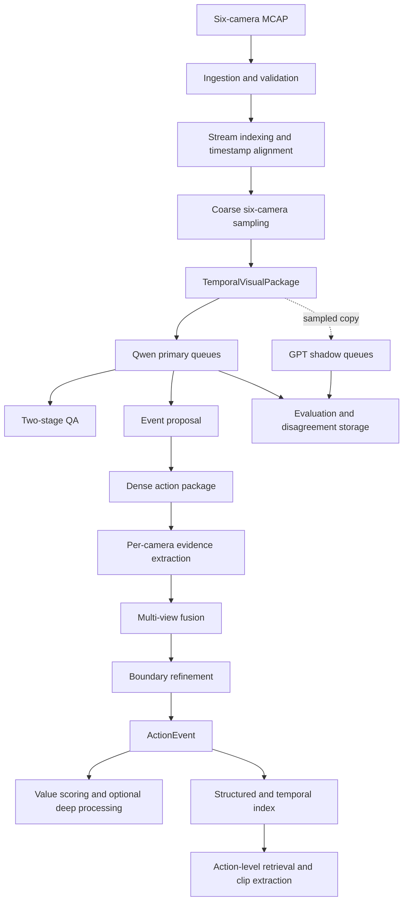
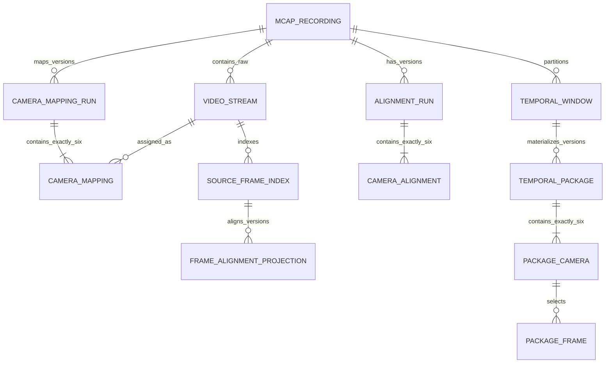
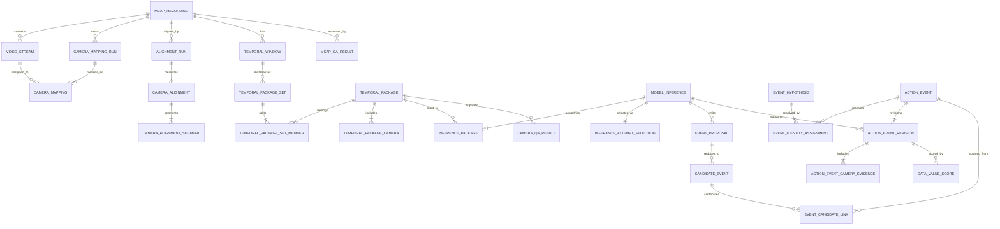

# Architecture Design V1: Native 6-Camera Video QA and Event Pipeline

| Field | Value |
|---|---|
| Status | Proposed architecture baseline |
| Version | 1.1 |
| Scope | Architecture and contracts only; no large-scale business implementation |
| Primary path | Qwen-based VLM |
| Experimental path | GPT shadow inference |
| Input | One MCAP recording containing exactly six camera streams |
| Primary output | Traceable physical `ActionEvent` records |

## 1. Purpose and scope

This document defines the first implementation boundary for an end-to-end pipeline that ingests 2-5 minute, six-camera MCAP recordings, performs video QA and temporal action annotation, and supports action-level retrieval. It makes module ownership, input and output contracts, persistence, concurrency, and failure semantics explicit before substantial business code is written.

V1 covers the following required design areas:

1. MCAP ingestion.
2. Native six-camera data modeling.
3. Timestamp alignment.
4. Uniform, adaptive, and dense sampling.
5. `TemporalVisualPackage`.
6. Model-agnostic `VisionModelAdapter`.
7. Qwen primary inference.
8. GPT shadow inference.
9. Camera-level and recording-level QA.
10. Event proposal and boundary refinement.
11. `ActionEvent`.
12. Multi-view fusion.
13. Structured storage and lineage.
14. Queueing, concurrency, and backpressure.
15. Benchmark design.
16. Throughput and capacity measurement.
17. Failure recovery, checkpointing, and idempotency.

### 1.1 Out of scope for Architecture V1

- Production provider credentials and provider-specific request code.
- A final choice of sampling rates or QA thresholds.
- A claim that either model is more accurate.
- A claim that the system currently sustains 500 hours/day.
- Full deep hand-pose, trajectory, embedding, or clip-rendering implementations.
- A final cloud vendor, queue product, database vendor, or deployment topology.
- An action/object ontology. V1 defines where ontology versions belong, not their labels.

### 1.2 Fixed requirements

The following are requirements, not options:

- Every valid source MCAP maps to exactly six logical camera slots, `cam_01` through `cam_06`.
- The production architecture is native six-camera. A one-, two-, or three-camera mode exists only as an offline benchmark ablation.
- QA examines all six camera streams.
- Actions are temporal physical events, not independent frame classifications.
- Camera observations are evidence for one physical event, not six separate events.
- Video reaches a VLM only after sampling and temporal window construction.
- Qwen is the production primary provider.
- GPT is an asynchronous experimental/shadow provider and cannot block or fail the primary path.
- Every result is traceable to MCAP, camera, canonical timestamp range, sampling plan, model invocation, prompt, and model version.
- Retrieval is centered on `ActionEvent` and synchronized action clips, not whole recordings.
- Sampling, quality, latency, cost, and capacity conclusions require measured benchmarks.

### 1.3 Terminology and time conventions

| Term | Definition |
|---|---|
| Recording hour | One hour on the physical recording timeline, regardless of camera count. |
| Camera-video hour | One hour from one camera stream. A complete one-hour recording contributes six camera-video hours. |
| Canonical time | Signed 64-bit integer nanoseconds relative to the start of an MCAP recording. |
| Interval | A half-open interval `[start_ns, end_ns)`. |
| Camera slot | A logical identifier `cam_01` ... `cam_06`, resolved by a versioned mapping policy. |
| Temporal window | A canonical time interval and processing purpose, without image payloads. |
| Temporal visual package | An immutable six-camera sampled-frame manifest for one temporal window. |
| Candidate event | A high-recall proposal that a physical action may exist in an interval. |
| Action event | One fused physical action with six camera evidence entries. |

Database and binary-contract time fields use signed 64-bit integer nanoseconds. JSON encodes every `*_ns` value as a canonical base-10 string matching `^-?[0-9]+$`; implementations parse it as BigInt/int64 and never through IEEE-754 `Number`. This keeps epoch-scale source timestamps and RFC 8785 manifest hashes exact across languages. APIs may additionally expose derived decimal seconds for display, but decimal seconds are never the persistence or join key. `source_frame_index` is seek/order metadata and must not be used for cross-camera temporal alignment.

## 2. Architecture overview



The diagram is a logical dataflow, not a single synchronous request chain. Each solid processing boundary is represented by durable work state. Fan-out occurs by temporal window and camera where safe; barriers aggregate exactly six camera outcomes where a recording-level or physical-event result is required.

### 2.1 Control-plane and data-plane separation

- The control plane contains queue messages, work ledgers, IDs, policies, versions, status, and artifact references.
- The data plane contains MCAP objects, decoded frames or byte ranges, package manifests, raw provider responses, and generated clips in object storage.
- Queue messages never contain MCAP files or image bytes. They carry immutable IDs, manifest hashes, attempt metadata, and deadlines.
- Large frame indexes may be stored in partitioned relational tables or Parquet. Lineage keys remain relational.

### 2.2 Recommended logical components

| Component | Input | Output | Responsibility |
|---|---|---|---|
| Ingestion service | Source object notification or submitted URI | `MCAPManifest`, validation status | Identify, inspect, validate, and register the source exactly once. |
| Stream indexer | Valid MCAP | Immutable raw video streams, one six-row mapping run, six `CameraStream` projections, and optional frame index | Resolve versioned camera roles and preserve source message locations. |
| Alignment service | Six stream timestamp series and sync metadata | Versioned `AlignmentManifest` | Map all source timestamps to one recording-relative timeline and quantify uncertainty. |
| Sampler | Window, alignment, sampling plan | Immutable `TemporalVisualPackage` | Select deterministic frame sets using uniform, adaptive, or dense policies. |
| Inference orchestrator | Package ID, task, policy | `ModelInference` | Apply prompt/model policy, call an adapter, validate structured output, and persist raw plus normalized results. |
| QA service | Coarse/dense inference results | Six `CameraQAResult` plus one `MCAPQAResult` | Detect per-camera issues and aggregate without automatically rejecting for one bad view. |
| Event proposer | Coarse package and signals | `CandidateEvent` records | Produce high-recall action intervals, merge duplicates, and schedule dense analysis. |
| Evidence extractor | Dense package | Six camera evidence records | Describe visible action evidence and uncertainty for every camera slot. |
| Fusion service | Candidate plus six evidence records | Coarse/final `ActionEvent` revision | Associate evidence with one physical event and resolve conflicts under a versioned policy. |
| Boundary refiner | Coarse event and padded dense window | Refined evidence and event revision | Separate action detection from precise start/end estimation. |
| Shadow selector | Package/result/hard-case signals | Shadow work item or no-op decision | Reproducibly sample experiments without affecting primary completion. |
| Evaluation service | Paired model results and ground truth | Metrics and `ModelDisagreementSample` | Compare providers, prompts, sampling policies, and camera ablations. |
| Retrieval service | Structured query and optional semantic query | Events and clip manifests | Filter structured event metadata first, then optionally rerank semantically. |

## 3. Cross-cutting contract rules

1. IDs are globally unique and immutable. UUIDv7 is the recommended default because it is sortable without encoding business meaning.
2. Every persisted contract carries `schema_version`; every decision carries its policy, prompt, model, ontology, or algorithm version.
3. Published derived records are append-only. Corrections create a new revision and a `supersedes_id`; raw inferences are never overwritten.
4. Source and derived artifacts have a URI, SHA-256 digest, byte count, media type, and producer version.
5. Accepted recordings, temporal packages, recording QA aggregates, and action evidence expose all six camera slots. Missing evidence is explicit; keys are never omitted.
6. A confidence value uses the `ConfidenceValue` contract below; it records its semantics, producer, input lineage, and calibration/policy version. Confidence is not treated as accuracy.
7. All work delivery is at least once. Correctness comes from deterministic logical work keys and idempotent commits, not an assumed exactly-once queue.
8. A successful stage transaction writes its result, checkpoint, metrics dimensions, and outbox messages atomically.
9. Every temporal result references an immutable alignment version. Re-alignment creates new downstream revisions rather than mutating old timestamps.
10. Referential deletes are restricted for lineage records. Retention is implemented by policy-driven artifact lifecycle, never by silently breaking foreign keys.
11. Scores, strengths, quality values, and reported/calibrated confidence are in `[0,1]` or explicitly null when unavailable. Rates are nonnegative, counts are nonnegative integers, and usable camera count is in `[0,6]`.
12. Every effective media/evidence interval validates `0 <= start_ns < end_ns <= duration_ns`; nullable evidence intervals are permitted only for an explicit non-observing/unavailable state. Fields explicitly named `requested_*` are planning intents: they require `requested_start_ns < requested_end_ns` but may extend outside the recording so clipping and lost context remain auditable.
13. Every temporal pipeline result denormalizes `mcap_id`, `start_ns`, and `end_ns` even when a foreign-key join can recover them. Non-temporal control/aggregate rows must point to typed temporal subjects.

```typescript
interface ConfidenceValue {
  value: number | null;
  kind: "MODEL_REPORTED" | "CALIBRATED" | "POLICY_DERIVED" | "DETERMINISTIC";
  semantics: string; // for example P(issue_present) or association reliability
  producerType: "MODEL_ATTEMPT" | "CALIBRATOR" | "POLICY" | "ALGORITHM";
  producerId: string;
  producerVersion: string;
  calibrationArtifactId: string | null;
  sourceConfidenceIds: string[];
}
```

The stored form gives each confidence value a `confidence_id`; nested JSON may embed the same fields for transport. A calibrated value points to the raw/model-reported value and frozen calibrator artifact. A policy-derived aggregate points to every input confidence and the aggregation policy. Bare numbers such as model self-reports, calibrated probabilities, evidence strengths, and final policy scores are never interchangeable merely because all lie in `[0,1]`.

## 4. MCAP ingestion design

### 4.1 Contract

**Input**

```json
{
  "source_uri": "object://bucket/path/recording.mcap",
  "source_version": "provider-etag-or-generation",
  "observed_size_bytes": 123456,
  "submitted_at": "RFC3339 timestamp"
}
```

**Output**

- One immutable `mcap_recording` row.
- One raw `artifact` row.
- One published camera-mapping run with exactly six mapping rows and six `CameraStream` projections for a `READY` recording.
- An `MCAPManifest` artifact and hash.
- One alignment work item, or a terminal quarantine status.

**Responsibility**

1. Deduplicate source notifications by provider/URI/object-version, then verify the content SHA-256.
2. Derive canonical `recording_identity` from ingestion namespace plus verified content SHA-256. Retain every URI/version as source aliases.
3. Read the MCAP summary/index where available; otherwise scan once and build an index.
4. Resolve video channels through a versioned topic-to-camera mapping.
5. Validate MCAP readability, timestamp ranges, declared codecs, stream decodability samples, and exactly six unique logical camera slots.
6. Record all validation failures. Never continue silently with an invalid count or ambiguous mapping.

An MCAP may contain non-camera or auxiliary channels. `raw_video_stream_count` and mapped `camera_count` are recorded separately; the hard invariant is exactly six unambiguous canonical camera mappings, not exactly six total MCAP channels.

### 4.2 Identity and validation

`mcap_id` is an opaque UUIDv7. Idempotency is enforced separately with a unique source fingerprint, so moving a source object does not accidentally rewrite identity. A production content digest may be computed while the MCAP is first streamed, avoiding a second full read.

An MCAP is eligible for `READY` only when all of these hold:

- The container parses without a fatal structural error.
- There are exactly six configured camera mappings and no duplicate logical slot.
- Each mapped stream has a supported, successfully probed decoder path. Unsupported/quarantined codecs cannot satisfy `READY`.
- Each stream exposes a usable timestamp range.
- The recording duration is positive and consistent with the selected timebase.
- The source content hash and manifest are durable.

Representative terminal error codes are `INVALID_CAMERA_COUNT`, `INVALID_CAMERA_MAPPING`, `CORRUPT_MCAP`, `UNSUPPORTED_CODEC`, `MISSING_TIMESTAMPS`, and `ZERO_DURATION`. An invalid record remains queryable with its validation evidence but does not enqueue downstream primary work.

### 4.3 State machine

```text
DISCOVERED -> HASHING -> INSPECTING -> VALIDATING -> READY
                                      |            |
                                      +-> INVALID  +-> ALIGNMENT_QUEUED

Any retryable infrastructure error -> RETRY_WAIT -> previous nonterminal state
Retry budget exhausted             -> FAILED -> quarantine/DLQ
```

Invalid source data and failed infrastructure work are different states. Invalid data is not retried until the source or mapping policy changes.

### 4.4 MCAP manifest

```json
{
  "schema_version": "1.0",
  "mcap_id": "uuid",
  "source": {
    "uri": "object://...",
    "version": "...",
    "sha256": "...",
    "bytes": 123456
  },
  "recording": {
    "start_utc": "RFC3339 or null",
    "end_utc": "RFC3339 or null",
    "duration_ns": "180000000000",
    "timebase": "mcap_log_time"
  },
  "camera_count": 6,
  "camera_mapping_run_id": "uuid",
  "camera_mapping_version": "...",
  "cameras": [
    {
      "camera_id": "cam_01",
      "role": "versioned-role",
      "stream_id": "uuid",
      "topic": "/camera/topic",
      "channel_id": 1,
      "codec": "...",
      "width": 1920,
      "height": 1080,
      "nominal_fps": 30.0,
      "source_start_ns": "0",
      "source_end_ns": "180000000000",
      "frame_count": 5400
    }
  ],
  "ingested_at": "RFC3339",
  "status": "READY"
}
```

The `cameras` array is canonically sorted and must contain exactly `cam_01` through `cam_06`; the example is abbreviated only for readability.

## 5. Native six-camera data model

### 5.1 Core entities

| Entity | Required fields | Key invariants |
|---|---|---|
| `mcap_recording` | `mcap_id`, source artifact, start/end UTC if known, `duration_ns`, timebase, `camera_count`, ingest status/timestamps | `camera_count = 6` before `READY`; source fingerprint unique. |
| `video_stream` | `stream_id`, `mcap_id`, topic/channel, codec, width/height, nominal FPS, source range, frame count | Immutable raw video channel; unrelated/auxiliary video may also exist. |
| `camera_mapping_run` | `mapping_run_id`, `mcap_id`, mapping policy/version, status, current pointer, created at | Published runs are immutable; exactly one is selected by a versioned decision. |
| `camera_mapping` | mapping run, `camera_id`, role, `stream_id` | Unique `(mapping_run_id, camera_id)`; exactly six rows per published run. |
| `source_frame_index` | `frame_id`, video stream, source epoch/timestamp, message offset/sequence, optional artifact reference | Immutable source identity; frame number is seek metadata only. |
| `frame_alignment_projection` | frame, mapping run/camera, alignment/segment, aligned timestamp | Immutable versioned projection; re-alignment adds rows rather than changing source frames. |
| `artifact` | `artifact_id`, URI, digest, bytes, media type, producer/version | Content immutable at the recorded URI/version. |

`CameraStream` is the joined contract `camera_mapping -> video_stream`, not a mutable raw-stream row. `camera_id` is a recording-local logical slot. `camera_role` describes its configured viewpoint or function and is versioned independently. A future physical camera catalog may be referenced, but physical serial numbers must not replace the six logical slots in pipeline contracts.

### 5.2 Cardinality



Cross-row cardinality checks such as "exactly six" are enforced when publishing a parent record in one transaction, not by trusting each producer. A database constraint or deferred trigger may reinforce the service check where the chosen database supports it.

### 5.3 Video provenance

Any extracted stream, decoded frame, preview, or clip records:

```text
artifact -> source message/frame -> video_stream -> camera_mapping/camera slot -> mcap_recording -> raw MCAP artifact
```

Temporary files are worker-local cache only. No temporary video becomes a pipeline result without an artifact record and the lineage above.

## 6. Multi-camera timestamp alignment

### 6.1 Input, output, responsibility

**Input:** Six stream timestamp series, MCAP log/publish timestamps, embedded sensor timestamps when present, sync pulses or clock metadata when present, and an alignment policy version.

**Output:** One immutable `alignment_run`, exactly six `camera_alignment` records, validation statistics, and an aligned frame index or lazy transform.

**Responsibility:** Select a source clock, fit transforms into one canonical timeline, quantify residual error, detect gaps/non-monotonicity, and prevent downstream use when alignment quality is unknown or below the configured policy.

### 6.2 Canonical representation

For camera `c` and transform segment `s`, use an anchored rational transform with wide integer intermediates:

```text
delta_source_ns = t_source_ns - source_anchor_ns_s
t_canonical_ns = canonical_anchor_ns_s
                 + round_by_policy(delta_source_ns * rate_numerator_s
                                   / rate_denominator_s)
```

Anchoring avoids multiplying epoch-scale nanoseconds by a float. The positive rational rate captures measured drift; drift ppm is a derived reporting value. Piecewise segments handle clock resets or drift changes. No transform parameter, anchor, segment-selection bound, or rounding rule is inferred and discarded.

Alignment methods are selected in decreasing order of direct evidence:

1. Common hardware clock or explicit synchronization markers.
2. Producer/sensor timestamps with documented clock relationships.
3. MCAP log/publish time when all streams share the writer clock.
4. Cross-correlation of visual/motion signals, marked estimated and lower confidence.
5. Manual calibration for benchmark or recovery, marked manual.

The system must not label streams "aligned" merely because timestamps exist.

### 6.3 Validation

- Check monotonicity, duplicates, clock resets, gaps, overlap duration, and out-of-range frames per stream.
- Store residual p50, p95, and maximum error, drift in ppm, coverage, method, and a policy-derived status.
- Require positive integer rate numerator/denominator, nonnegative residual/error, coverage in `[0,1]`, and ordered non-overlapping message-order bounds. Clock-reset segments carry distinct source epoch IDs, so numerically overlapping reset timestamps remain unambiguous.
- Retain both `source_timestamp_ns` and `aligned_timestamp_ns` on every selected frame. Source-frame identity is immutable; each aligned projection is separately keyed by `(source_frame_id, alignment_id)` and references its transform segment. Re-alignment appends projections and never overwrites prior aligned timestamps.
- Resolve a sampling target timestamp with a documented nearest-frame rule and maximum tolerance. The selected frame stores `delta_to_target_ns`.
- Clip effective downstream media/evidence intervals to `[0, duration_ns)` and mark clipping explicitly; retain the original out-of-bounds `requested_*` planning interval.
- Re-alignment produces a new `alignment_id`; packages and results referencing the old version remain reproducible and are marked superseded if recomputed.

### 6.4 Alignment manifest

```json
{
  "schema_version": "1.0",
  "alignment_id": "uuid",
  "mcap_id": "uuid",
  "camera_mapping_run_id": "uuid",
  "reference_timebase": "recording_relative_ns",
  "canonical_origin": {
    "source": "mcap_recording_start_in_reference_clock",
    "reference_timestamp_ns": "1710000000000000000",
    "utc": "RFC3339-or-null"
  },
  "method": "hardware_sync|sensor_clock|mcap_log_time|cross_correlation|manual",
  "algorithm_version": "...",
  "status": "VALID|DEGRADED|INVALID|UNVERIFIED",
  "cameras": {
    "cam_01": {
      "source_clock_id": "...",
      "source_timestamp_unit": "ns",
      "derived_drift_ppm": 0.0,
      "residual_p95_ns": "0",
      "max_error_ns": "0",
      "coverage": 1.0,
      "segments": [
        {"segment_id": "uuid", "source_epoch_id": "epoch-0", "source_order_start": 0, "source_order_end": 5400, "source_start_ns": "1710000000000000000", "source_end_ns": "1710000180000000000", "source_anchor_ns": "1710000000000000000", "canonical_anchor_ns": "0", "rate_numerator": "1", "rate_denominator": "1", "rounding": "HALF_EVEN"}
      ],
      "status": "VALID"
    }
  },
  "policy_version": "...",
  "created_at": "RFC3339"
}
```

All six camera keys are required in the real manifest.

The persisted canonical origin is the MCAP recording start represented in the reference clock. If it cannot be observed directly, the manifest marks the origin estimated, records leading-gap uncertainty, and adjusts usable coverage without redefining zero. The origin, source clock IDs/units, transform parameters or segments, and rounding convention are sufficient to reproduce every aligned timestamp independently.

Alignment admission is purpose-specific and versioned. Production package materialization rejects `INVALID` and `UNVERIFIED` alignments. A `DEGRADED` alignment is allowed only when its measured residual/coverage satisfies the consuming QA/action policy, and its uncertainty propagates downstream. Benchmark/manual workflows may opt into otherwise rejected alignment states only with an explicit non-production flag.

## 7. Sampling layer design

### 7.1 Interface

```text
sample(
  window: TemporalWindow,
  streams: SixCameraStreamSet,
  camera_mapping_run_id: UUID,
  alignment_id: UUID,
  plan: SamplingPlan,
  purpose: SamplingPurpose,
  idempotency_key: String
) -> TemporalPackageSet
```

`SamplingPurpose` is one of `QA_COARSE`, `QA_DENSE`, `EVENT_PROPOSAL`, `ACTION_DENSE`, `BOUNDARY_REFINEMENT`, or an explicitly versioned future value. The plan contains global defaults and per-camera overrides.

`TemporalPackageSet` contains `split_group_id`, original window/requested/effective bounds, ordered package IDs, per-child requested/effective intervals and overlap, split reason/policy/version, the capability snapshot used to enforce provider limits, and a task-specific reduction policy. It contains one package when no split is required. Provider-limit or frame-budget splitting is planned before inference; every child result joins a durable split barrier and is reduced into one logical QA/proposal/action/boundary result before downstream semantic aggregation.

```json
{
  "schema_version": "1.0",
  "package_set_id": "uuid",
  "split_group_id": "uuid",
  "mcap_id": "uuid",
  "window_id": "uuid",
  "camera_mapping_run_id": "uuid",
  "alignment_id": "uuid",
  "requested_start_ns": "11000000000",
  "requested_end_ns": "17000000000",
  "start_ns": "12000000000",
  "end_ns": "16000000000",
  "split_reason": "FRAME_BUDGET|PROVIDER_LIMIT|NONE",
  "split_policy_version": "...",
  "capability_snapshot_digest": "sha256-or-null",
  "split_plan_digest": "sha256",
  "members": [
    {"package_id": "uuid", "ordinal": 0, "part_count": 1, "requested_start_ns": "11000000000", "requested_end_ns": "17000000000", "start_ns": "12000000000", "end_ns": "16000000000", "overlap_before_ns": "0", "overlap_after_ns": "0"}
  ],
  "member_manifest_sha256": "...",
  "reduction_policy_version": "...",
  "created_at": "RFC3339"
}
```

`split_plan_digest` hashes the window logical key, split reason/policy, pinned capability snapshot, and ordered member coordinates with all package IDs and digest-output fields omitted. After children are materialized, `member_manifest_sha256` hashes the ordered tuple `(ordinal, child semantic_content_sha256, requested/effective bounds, overlap)` and omits itself. This lets child identities include their split coordinate without depending on a parent hash that depends on the children.

### 7.2 Sampling modes

**Uniform sampling**

- Construct a timestamp grid over the half-open window at configured `target_fps`.
- Select the closest decodable frame under the alignment tolerance with a deterministic tie-break rule.
- Record missed targets and actual FPS. Do not duplicate a frame to make the requested count appear complete.
- Intended uses: coarse QA, scene context, and initial proposal generation.

**Adaptive sampling**

- Consume versioned, lightweight signals such as optical/motion energy, scene change, blur change, occlusion change, hand presence, estimated hand-object distance, or object motion.
- Map signal ranges to configured minimum/maximum sampling rates and hysteresis rules.
- Record every trigger and policy decision in sampling metadata.
- Treat triggers as proposal features, not ground-truth actions.

**Dense temporal sampling**

- Operate only on candidate or suspicious windows plus configured pre/post padding.
- Permit per-camera density based on visibility and QA, while action packages retain all six camera entries.
- Intended uses: contact/release evidence, action classification, and boundary refinement.
- Split an oversized window into overlapping packages under a versioned split policy. Never silently truncate frames to meet provider limits.

### 7.3 Configuration

```json
{
  "sampling_plan_id": "uuid",
  "version": "experiment-or-production-version",
  "qa_sampling_rate_fps": 1.0,
  "event_sampling_rate_fps": 2.0,
  "dense_sampling_rate_fps": 5.0,
  "per_camera": {
    "cam_04": {"dense_sampling_rate_fps": 8.0}
  },
  "adaptive_policy": {
    "version": "...",
    "min_fps": 0.2,
    "max_fps": 5.0,
    "triggers": ["motion_delta", "scene_change"]
  },
  "frame_budget": {
    "max_frames_per_camera": 64,
    "max_frames_total": 384,
    "overflow_policy": "SPLIT_WINDOW"
  }
}
```

Values above illustrate configuration shape only; they are not production recommendations. Production values are selected by the benchmark in Section 18.

### 7.4 Sampling invariants and errors

- The package manifest always contains `cam_01` through `cam_06` in canonical order.
- A targeted dense camera may have a higher rate while the other cameras retain low-rate context. If policy intentionally omits frames, the camera entry is present with `NOT_REQUESTED` and a reason.
- Action annotation packages require contextual evidence from every usable camera; unavailable cameras remain explicit.
- Each selected frame lies in the package interval, references the same MCAP and alignment version, and carries both timestamps.
- A requested uniform/adaptive/dense camera uses a finite `target_fps > 0` and positive finite frame budget. Zero rate is valid only for an explicit `NOT_REQUESTED`/disabled camera policy.
- A package is deterministic for `(source_content_digest, camera_mapping_run_id, window_logical_key, purpose, alignment_id, sampling_plan, adaptive_feature_manifest_digest, feature_detector_version, extractor_version, split_plan_digest, member_ordinal, member_requested/effective_bounds, overlap)`.
- Permanent decode failures identify camera and timestamp and yield a partial/degraded package only if the consuming policy permits it; otherwise the unit is quarantined.

## 8. TemporalWindow and TemporalVisualPackage

### 8.1 TemporalWindow

```json
{
  "schema_version": "1.0",
  "window_id": "uuid",
  "mcap_id": "uuid",
  "alignment_id": "uuid",
  "camera_mapping_run_id": "uuid",
  "requested_start_ns": "11000000000",
  "requested_end_ns": "17000000000",
  "start_ns": "12000000000",
  "end_ns": "16000000000",
  "context_truncated": true,
  "purpose": "ACTION_DENSE",
  "parent_candidate_event_id": "uuid-or-null",
  "source_event_revision_id": null,
  "parent_window_id": null,
  "source_lineage_digest": "sha256",
  "refinement_role": "CANDIDATE_DENSE|ONSET|OFFSET|NONE",
  "generation": 1,
  "boundary_uncertainty_ns": "500000000",
  "created_at": "RFC3339"
}
```

The temporal window is a scheduling and lineage object. It does not contain frames. A root coarse window has no typed source subject and uses the planner-manifest digest. Candidate-dense and boundary windows point to their exact candidate or source event revision, parent window when applicable, and a `source_lineage_digest` over the source logical keys, evidence/refinement inputs, padding/clipping policy, and generation. Equal time bounds do not make windows equivalent when those lineage inputs differ.

### 8.2 TemporalVisualPackage wire schema

```json
{
  "schema_version": "1.0",
  "package_id": "uuid",
  "semantic_content_sha256": "sha256",
  "mcap_id": "uuid",
  "window_id": "uuid",
  "package_set_id": "uuid",
  "split_plan_digest": "sha256",
  "split_member": {"ordinal": 0, "part_count": 1, "requested_start_ns": "11000000000", "requested_end_ns": "17000000000", "start_ns": "12000000000", "end_ns": "16000000000", "overlap_before_ns": "0", "overlap_after_ns": "0", "split_policy_version": "..."},
  "alignment_id": "uuid",
  "camera_mapping_run_id": "uuid",
  "requested_start_ns": "11000000000",
  "requested_end_ns": "17000000000",
  "start_ns": "12000000000",
  "end_ns": "16000000000",
  "context_truncated": true,
  "purpose": "QA_COARSE",
  "cameras": {
    "cam_01": {
      "status": "AVAILABLE",
      "stream_id": "uuid",
      "frames": [
        {
          "frame_id": "uuid",
          "alignment_projection_id": "uuid",
          "ordinal": 0,
          "aligned_timestamp_ns": "12000000000",
          "source_timestamp_ns": "1710000000000000000",
          "delta_to_target_ns": "0",
          "source_locator": {"stream_id": "uuid", "message_offset": 1234, "sequence": 1},
          "materialized_artifact": {"uri": "object://...", "sha256": "..."},
          "width": 1920,
          "height": 1080,
          "quality_flags": []
        }
      ],
      "sampling": {
        "strategy": "UNIFORM",
        "target_fps": 0.25,
        "actual_fps": 0.25,
        "target_count": 1,
        "actual_count": 1,
        "missed_targets": 0,
        "trigger_features": []
      },
      "missing_reason": null
    },
    "cam_02": {"status": "AVAILABLE", "stream_id": "uuid", "frames": [{"frame_id": "uuid", "alignment_projection_id": "uuid", "ordinal": 0, "aligned_timestamp_ns": "12000000000", "source_timestamp_ns": "1710000000000000000", "delta_to_target_ns": "0", "source_locator": {"stream_id": "uuid", "message_offset": 2234, "sequence": 1}, "materialized_artifact": {"uri": "object://...", "sha256": "..."}, "width": 1920, "height": 1080, "quality_flags": []}], "sampling": {"strategy": "UNIFORM", "target_fps": 0.25, "actual_fps": 0.25, "target_count": 1, "actual_count": 1, "missed_targets": 0, "trigger_features": []}, "missing_reason": null},
    "cam_03": {"status": "AVAILABLE", "stream_id": "uuid", "frames": [{"frame_id": "uuid", "alignment_projection_id": "uuid", "ordinal": 0, "aligned_timestamp_ns": "12000000000", "source_timestamp_ns": "1710000000000000000", "delta_to_target_ns": "0", "source_locator": {"stream_id": "uuid", "message_offset": 3234, "sequence": 1}, "materialized_artifact": {"uri": "object://...", "sha256": "..."}, "width": 1920, "height": 1080, "quality_flags": []}], "sampling": {"strategy": "UNIFORM", "target_fps": 0.25, "actual_fps": 0.25, "target_count": 1, "actual_count": 1, "missed_targets": 0, "trigger_features": []}, "missing_reason": null},
    "cam_04": {"status": "AVAILABLE", "stream_id": "uuid", "frames": [{"frame_id": "uuid", "alignment_projection_id": "uuid", "ordinal": 0, "aligned_timestamp_ns": "12000000000", "source_timestamp_ns": "1710000000000000000", "delta_to_target_ns": "0", "source_locator": {"stream_id": "uuid", "message_offset": 4234, "sequence": 1}, "materialized_artifact": {"uri": "object://...", "sha256": "..."}, "width": 1920, "height": 1080, "quality_flags": []}], "sampling": {"strategy": "UNIFORM", "target_fps": 0.25, "actual_fps": 0.25, "target_count": 1, "actual_count": 1, "missed_targets": 0, "trigger_features": []}, "missing_reason": null},
    "cam_05": {"status": "AVAILABLE", "stream_id": "uuid", "frames": [{"frame_id": "uuid", "alignment_projection_id": "uuid", "ordinal": 0, "aligned_timestamp_ns": "12000000000", "source_timestamp_ns": "1710000000000000000", "delta_to_target_ns": "0", "source_locator": {"stream_id": "uuid", "message_offset": 5234, "sequence": 1}, "materialized_artifact": {"uri": "object://...", "sha256": "..."}, "width": 1920, "height": 1080, "quality_flags": []}], "sampling": {"strategy": "UNIFORM", "target_fps": 0.25, "actual_fps": 0.25, "target_count": 1, "actual_count": 1, "missed_targets": 0, "trigger_features": []}, "missing_reason": null},
    "cam_06": {"status": "AVAILABLE", "stream_id": "uuid", "frames": [{"frame_id": "uuid", "alignment_projection_id": "uuid", "ordinal": 0, "aligned_timestamp_ns": "12000000000", "source_timestamp_ns": "1710000000000000000", "delta_to_target_ns": "0", "source_locator": {"stream_id": "uuid", "message_offset": 6234, "sequence": 1}, "materialized_artifact": {"uri": "object://...", "sha256": "..."}, "width": 1920, "height": 1080, "quality_flags": []}], "sampling": {"strategy": "UNIFORM", "target_fps": 0.25, "actual_fps": 0.25, "target_count": 1, "actual_count": 1, "missed_targets": 0, "trigger_features": []}, "missing_reason": null}
  },
  "sampling_plan": {
    "sampling_plan_id": "uuid",
    "version": "...",
    "strategy_by_camera": {},
    "limits": {}
  },
  "frame_count_total": 6,
  "manifest_artifact_id": "uuid",
  "manifest_bytes_sha256": "sha256",
  "producer_version": "...",
  "created_at": "RFC3339"
}
```

`FrameRef` always contains stream/time/source-locator provenance. A published VLM-consumable `TemporalVisualPackage` also requires an immutable `materialized_artifact` for every selected frame. Seek-only selection is stored as a `SamplingPlan`/`FrameSelectionManifest`; materialization creates a new immutable package rather than editing a published manifest.

Camera status semantics are:

| Status | Meaning |
|---|---|
| `AVAILABLE` | The entry meets the purpose-specific minimum frame count and coverage. Zero frames is invalid for this status. |
| `NO_FRAME` | Sampling targets existed but no source frame met the selection/tolerance policy. |
| `UNAVAILABLE` | The mapped source stream cannot provide evidence for this interval. |
| `CORRUPT` | Relevant source frames/messages failed deterministic decode or integrity checks. |
| `NOT_REQUESTED` | Policy intentionally omitted this camera's frames for a camera-targeted task; reason is required. |

Minimum usable camera count, minimum frames/coverage per camera, allowable statuses, and whether low-rate cross-view context is required are versioned by purpose. `ACTION_DENSE`, `BOUNDARY_REFINEMENT`, and production multi-view reasoning require evidence from every usable view and explicit entries for all others. `AVAILABLE` with an empty frame array is rejected. Requested versus effective/clipped bounds and `context_truncated` make recording-edge behavior auditable.

The manifest validator also requires `frame_count_total` to equal the sum of per-camera `actual_count` values and the number of frame entries. Per-camera ordinals are contiguous, aligned timestamps are nondecreasing, and every rate is nonnegative.

Package hashing uses two explicit, non-self-referential preimages:

1. `semantic_content_sha256 = SHA256(RFC8785(semantic_projection))`. The projection includes schema version, immutable source-content digest, semantic digests of the mapping/alignment/window, window purpose and requested/effective bounds, split-plan member coordinates, canonical camera order, ordered source locators plus frame-content digests, sampling/adaptive-feature inputs, and producer/extractor versions. It excludes every opaque row ID (`package_id`, `package_set_id`, `window_id`, `mcap_id`, mapping/alignment UUIDs), `semantic_content_sha256`, manifest artifact identity/URI, serialization-only metadata, and `created_at`. Content digests replace excluded lineage UUIDs in the projection.
2. `manifest_bytes_sha256 = SHA256(exact_manifest_bytes)`. The immutable serialized manifest includes `semantic_content_sha256` but omits `manifest_bytes_sha256`; the byte digest is stored in the external `artifact` and `temporal_package` rows and may be returned in a retrieval envelope. Therefore neither digest includes itself.

`manifest_artifact_id` and `manifest_bytes_sha256` in the example are retrieval-envelope metadata, not members of the bytes being hashed. Any serialization or canonicalization change can change the byte digest without changing semantic identity; a changed semantic input changes the semantic digest and creates a new package derivation.

### 8.3 Package lifecycle

1. Create or reuse an immutable `TemporalWindow`.
2. Resolve the deterministic sampling work key.
3. Materialize or reference frames and build the canonical manifest.
4. Validate camera keys, time bounds, ordering, counts, digests, and alignment.
5. Compute the semantic and exact-byte digests, then publish the immutable manifest atomically.
6. Enqueue consumer tasks with only `package_id` and `manifest_bytes_sha256`.

A package is never edited after publication. Different sampling, alignment, extractor, or split policy creates another package linked to the same or a revised window.

## 9. VisionModelAdapter interface

### 9.1 Provider-neutral contract

```typescript
type VisionTask =
  | "QA_COARSE"
  | "QA_DENSE"
  | "EVENT_PROPOSAL"
  | "ACTION_EVIDENCE"
  | "BOUNDARY_REFINEMENT"
  | "FUSION_ADJUDICATION";

type CameraSlot = "cam_01" | "cam_02" | "cam_03" | "cam_04" | "cam_05" | "cam_06";
type SixCameraMap<T> = { [K in CameraSlot]: T };

interface JsonSchemaRef {
  schemaId: string;
  version: string;
  artifactId: string;
  sha256: string;
}

interface ModelCapabilities {
  schemaVersion: string;
  snapshotId: string;
  snapshotDigest: string;
  provider: string;
  modelName: string;
  modelVersion: string;
  supportedTasks: VisionTask[];
  inputModes: Array<"IMAGE" | "MULTI_IMAGE" | "VIDEO">;
  acceptedMediaTypes: string[];
  maxImagesPerRequest: number | null;
  maxPixelsPerImage: number | null;
  maxPayloadBytes: number | null;
  maxInputTokens: number | null;
  supportsJsonSchema: boolean;
  supportsProviderIdempotency: boolean;
  concurrencyClass: string;
  dataHandlingPolicyVersion: string;
  observedAt: string;
}

interface EvidenceRefs {
  packageIds: string[];
  frameIds: string[];
}

interface CameraQAObservationOutput {
  cameraId: CameraSlot;
  observedInterval: { startNs: string; endNs: string };
  status: "GOOD" | "DEGRADED" | "UNUSABLE" | "UNKNOWN";
  issues: Array<{ code: string; interval: { startNs: string; endNs: string }; severity: string; confidence: ConfidenceValue }>;
  confidence: ConfidenceValue;
  evidence: EvidenceRefs;
}

interface EventProposalOutput {
  proposals: Array<{
    ordinal: number;
    interval: { startNs: string; endNs: string };
    labelHint: string | null;
    confidence: ConfidenceValue;
    cameraCoverage: SixCameraMap<string>;
    evidence: EvidenceRefs;
  }>;
}

interface CameraActionObservationOutput {
  cameraId: CameraSlot;
  status: "SUPPORTING" | "PARTIAL" | "NO_EVENT" | "OCCLUDED" | "UNUSABLE" | "MISSING";
  eventInterval: { startNs: string; endNs: string } | null;
  observedInterval: { startNs: string; endNs: string } | null;
  visibility: number | null;
  observedFrameCount: number;
  coverageFraction: number;
  observationPolicyVersion: string;
  confidence: ConfidenceValue;
  evidence: EvidenceRefs;
}

interface ActionEvidenceOutput {
  candidateEventId: string;
  cameras: SixCameraMap<CameraActionObservationOutput>;
  crossViewHypotheses: Array<{ ordinal: number; interval: { startNs: string; endNs: string }; actionType: string; confidence: ConfidenceValue }>;
}

interface BoundaryRefinementOutput {
  actionEventRevisionId: string;
  cameras: SixCameraMap<{
    status: "OBSERVED" | "NO_BOUNDARY" | "OCCLUDED" | "UNUSABLE" | "MISSING";
    observedInterval: { startNs: string; endNs: string } | null;
    onsetInterval: { startNs: string; endNs: string } | null;
    offsetInterval: { startNs: string; endNs: string } | null;
    confidence: ConfidenceValue;
    evidence: EvidenceRefs;
  }>;
}

interface FusionAdjudicationOutput {
  hypotheses: Array<{ ordinal: number; interval: { startNs: string; endNs: string }; actionType: string; conflictCodes: string[]; confidence: ConfidenceValue }>;
  abstained: boolean;
  rationaleArtifactId: string | null;
}

type VisionOutputByTask = {
  QA_COARSE: { cameras: SixCameraMap<CameraQAObservationOutput> };
  QA_DENSE: { cameras: SixCameraMap<CameraQAObservationOutput> };
  EVENT_PROPOSAL: EventProposalOutput;
  ACTION_EVIDENCE: ActionEvidenceOutput;
  BOUNDARY_REFINEMENT: BoundaryRefinementOutput;
  FUSION_ADJUDICATION: FusionAdjudicationOutput;
};

interface NormalizedOutputEnvelope<TTask extends VisionTask> {
  task: TTask;
  outputSchema: JsonSchemaRef;
  packageInputSetSha256: string;
  payload: VisionOutputByTask[TTask];
}

interface VisionInferenceRequest<TTask extends VisionTask> {
  logicalInvocationId: string;
  requestId: string;
  idempotencyKey: string;
  provider: string;
  modelName: string;
  modelVersion: string;
  packageSetId: string | null;
  packageInputs: Array<{
    packageId: string;
    packageSemanticContentSha256: string;
    packageManifestSha256: string;
    role: string;
    ordinal: number;
  }>;
  packageInputSetSha256: string;
  task: TTask;
  promptVersion: string;
  promptArtifactId: string;
  promptSha256: string;
  renderedInputDigest: string;
  outputSchema: JsonSchemaRef;
  capabilitySnapshotId: string;
  capabilitySnapshotDigest: string;
  modelPolicyVersion: string;
  generationConfig: Record<string, unknown>;
  providerIdempotencyKey: string;
  timeoutMs: number;
  metadata: Record<string, string>;
}

interface VisionUsage {
  inputFrames: number;
  inputImages: number;
  inputTokens: number | null;
  outputTokens: number | null;
  cost: number | null;
  currency: string | null;
}

interface VisionInferenceSuccess<T> {
  status: "SUCCEEDED";
  providerRequestId: string;
  provider: string;
  modelName: string;
  modelVersion: string;
  normalizedOutput: T;
  rawOutputArtifactId: string;
  schemaValid: true;
  reportedConfidence: number | null;
  usage: VisionUsage;
  latencyMs: number;
}

interface VisionInferenceFailure {
  status: "FAILED" | "TIMEOUT" | "CANCELLED" | "INVALID_OUTPUT";
  providerRequestId: string | null;
  provider: string;
  modelName: string;
  modelVersion: string;
  normalizedOutput: null;
  rawOutputArtifactId: string | null;
  schemaValid: false;
  reportedConfidence: null;
  usage: Partial<VisionUsage>;
  latencyMs: number;
  failure: {
    code: string;
    detail: string;
    retryability: "RETRYABLE" | "RATE_LIMITED" | "PERMANENT";
  };
}

type VisionInferenceOutcome<T> = VisionInferenceSuccess<T> | VisionInferenceFailure;

interface VisionModelAdapter {
  readonly provider: string;
  capabilities(modelName: string, modelVersion: string): Promise<ModelCapabilities>;
  infer<TTask extends VisionTask>(
    request: VisionInferenceRequest<TTask>
  ): Promise<VisionInferenceOutcome<NormalizedOutputEnvelope<TTask>>>;
}
```

The actual implementation language may differ. The semantics may not. The interfaces above are the normalized envelope shapes; the authoritative validation contracts are immutable JSON Schema artifacts referenced by `schemaId`, version, artifact ID, and digest. Their schemas close unknown fields unless explicitly allowed, encode nanoseconds as decimal strings, enforce interval ordering, and enforce exactly the six camera keys where applicable. Conditional validation requires `NO_EVENT` to have a nonempty observed interval, positive observed-frame count/coverage, and package/inference provenance; missing/unusable states cannot masquerade as negative evidence. Empty proposal/hypothesis arrays and explicit abstentions are valid semantic outputs; missing required camera keys are not.

### 9.2 Adapter responsibilities

- Resolve package frame references into the provider's accepted image/video representation without changing semantic ordering.
- Require at least one ordered package input; verify the input-set digest and a consistent MCAP/mapping/alignment derivation across all members.
- Enforce provider limits before sending. Package splitting is orchestrator policy, not silent adapter truncation.
- Return and persist a capability snapshot. The orchestrator rejects a request when the pinned task/media/schema requirements exceed it; capability changes create a new split/invocation derivation rather than changing an in-flight request.
- Translate common timeout, cancellation, retry, usage, and safety/error metadata into normalized types.
- Preserve the raw response as an immutable artifact before normalization.
- Return provider identity and provider request ID when one exists. Pre-submission failures use a null provider ID and a normalized failure envelope.
- Never decide whether an output becomes production truth.

### 9.3 Orchestrator responsibilities

- Select adapter, model, prompt, task-specific response schema, and capability snapshot using a versioned policy.
- Create the `ModelInference` attempt before calling the provider.
- Apply rate limits, concurrency limits, deadlines, circuit breakers, and retry classification.
- Validate normalized output against the task schema. A syntactically successful but invalid response is `INVALID_OUTPUT`, not a successful inference.
- Persist timestamps, latency, frame/image/token counts, cost, retry count, raw output, normalized output, and error details.
- Select Qwen results for production and keep shadow results isolated.

### 9.4 Error taxonomy

| Class | Examples | Default handling |
|---|---|---|
| Transient | Rate limit, provider 5xx, connection reset, temporary object-store read | Bounded exponential retry with jitter and `Retry-After`. |
| Capacity | Local GPU OOM, provider context/frame limit | Reduce concurrency or split under policy; never silently drop cameras/frames. |
| Permanent input | Unsupported media, corrupt referenced frame, schema mismatch | Quarantine the work unit and preserve diagnostic artifacts. |
| Invalid output | Non-JSON output, missing required camera evidence, invalid interval | Optional constrained repair attempt, then fail or human-review route. |
| SLA deadline miss | T+1 target passes while work remains | Continue under elevated lateness priority and alert; do not turn a soft SLA into cancellation. |
| Hard cancellation/expiry | Explicit operator cancellation or configured execution expiry | Preserve attempt and mark `CANCELLED`; do not report a fabricated result. |

## 10. Qwen primary path

### 10.1 Production flow

```text
Primary work item
  -> validate package semantic/manifest-byte digests and six-camera contract
  -> resolve Qwen model/prompt/output policy
  -> persist inference intent
  -> acquire primary quota and deadline budget
  -> QwenAdapter.infer
  -> preserve raw output
  -> normalize and validate structured output
  -> persist completed ModelInference attempt
  -> atomically enqueue the next primary stage
```

Qwen is selected with `provider = "qwen"` for all production QA, proposal, action-evidence, and boundary-refinement work. A Qwen failure does not silently promote a GPT result to production. It leaves the required work incomplete until bounded retry, operator resolution, or an explicit future production policy says otherwise.

### 10.2 ModelInference record

Every attempt, including failures, is stored independently:

```json
{
  "schema_version": "1.0",
  "inference_id": "uuid-attempt-id",
  "logical_invocation_id": "stable-logical-id",
  "request_id": "internal-request-correlation-id",
  "idempotency_key": "stable-logical-key",
  "mcap_id": "uuid",
  "package_set_id": "uuid",
  "package_id": "uuid-or-null",
  "package_ids": ["uuid"],
  "camera_mapping_run_id": "uuid",
  "alignment_id": "uuid",
  "start_ns": "12000000000",
  "end_ns": "16000000000",
  "stage": "ACTION_EVIDENCE",
  "provider": "qwen",
  "model_name": "configured-name",
  "model_version": "configured-version",
  "adapter_version": "...",
  "prompt_version": "...",
  "prompt_artifact_id": "uuid",
  "prompt_sha256": "...",
  "rendered_input_digest": "...",
  "output_schema_id": "...",
  "output_schema_version": "...",
  "output_schema_artifact_id": "uuid",
  "output_schema_sha256": "...",
  "capability_snapshot_id": "uuid",
  "capability_snapshot_digest": "...",
  "input_manifest_set_sha256": "ordered-package-member-digest",
  "input_config": {},
  "sampling_config": {},
  "generation_config": {},
  "provider_request_id": "...",
  "experiment_id": null,
  "shadow_route_id": null,
  "primary_inference_id": null,
  "shadow": false,
  "attempt": 1,
  "retry_count": 0,
  "status": "SUCCEEDED",
  "queued_at": "RFC3339",
  "started_at": "RFC3339",
  "completed_at": "RFC3339",
  "latency_ms": 1234,
  "raw_output": {"artifact_id": "uuid", "sha256": "..."},
  "normalized_output": {},
  "output_valid": true,
  "reported_confidence": {"value": 0.87, "kind": "MODEL_REPORTED", "semantics": "provider_self_report", "producer_type": "MODEL_ATTEMPT", "producer_id": "uuid-attempt-id", "producer_version": "configured-version", "calibration_artifact_id": null, "source_confidence_ids": []},
  "calibrated_confidence": {"value": null, "kind": "CALIBRATED", "semantics": "P(task_output_correct)", "producer_type": "CALIBRATOR", "producer_id": "not-fitted", "producer_version": "none", "calibration_artifact_id": null, "source_confidence_ids": ["reported-confidence-id"]},
  "usage": {
    "input_frames": 120,
    "input_images": 120,
    "input_tokens": null,
    "output_tokens": null,
    "cost": null,
    "currency": null
  },
  "failure": {"code": null, "detail": null},
  "created_at": "RFC3339"
}
```

`logical_invocation_id` is deterministic over ordered package manifest content, task, provider/model/adapter, exact prompt/rendered-input digest, output-schema artifact digest, capability snapshot, and generation configuration. Retries produce new attempt IDs under the same logical invocation. `inference_attempt_selection` selects one successful attempt under a unique constraint, preventing queue redelivery from creating duplicate downstream records. Every inference-backed normalized intermediate references that selection; typed production decisions then record which intermediate results drive later semantic stages. Provider name alone never implies selection.

### 10.3 Primary controls

- Reserve provider quota/concurrency for production work; shadow work cannot borrow it when primary backlog is above its low-water mark.
- Prioritize by absolute deadline and stage class while preserving fairness. Coarse QA must not starve event completion, and dense work must not consume unbounded capacity.
- Use provider-specific token/image/request budgets obtained from capability discovery and configuration.
- Record queue wait separately from adapter/API latency.
- Apply circuit breakers by provider/model/region. An open circuit holds work durably and exposes deadline risk; it does not lose work.
- Treat raw model confidence as an uncalibrated feature until benchmark calibration exists.

## 11. GPT shadow path

### 11.1 Isolation guarantee

The shadow branch has separate queue names, task ledger state, concurrency pools, credentials, rate budgets, retry budgets, cost budgets, and completion predicates. Primary completion never waits for shadow selection, execution, evaluation, or failure.

Where infrastructure is physically shared, resource governance must still reserve CPU, GPU, memory, network, and object-store bandwidth for primary. Merely naming a second queue is not sufficient isolation.

### 11.2 Selection policy

Shadow selection is the union of two independently recorded mechanisms:

1. **Stable random sampling:** `hash(package_set_member_manifest_digest, task, experiment_contract_digest, shadow_policy_version)` is mapped to `[0,1)` and compared with `shadow_sample_ratio`. The digest covers immutable ordered package content, so copying/reimporting the same source or minting a new row UUID cannot change cohort membership.
2. **Hard-case sampling:** route after the relevant Qwen/fusion result when configured rules detect low calibrated confidence, high view disagreement, ambiguous QA, uncertain boundaries, invalid-output repair, or another versioned signal.

The union is deduplicated with one route key per package/task/experiment contract/policy. Reasons are an append-only child set/bitmask, so random plus hard-case selection creates one GPT call. A budget gate may mark selected work `SKIPPED_BUDGET` or defer it; selection must never disappear silently. Hard-case samples are biased and are reported separately from the population-random sample.

```json
{
  "shadow_route_id": "uuid",
  "primary_inference_id": "uuid-or-null",
  "package_set_id": "uuid",
  "package_set_member_manifest_digest": "sha256",
  "task": "ACTION_EVIDENCE",
  "reasons": ["RANDOM", "LOW_CONFIDENCE"],
  "sample_ratio": 0.05,
  "policy_version": "...",
  "status": "SELECTED|DEFERRED|QUEUED|RUNNING|RETRY_WAIT|SUCCEEDED|FAILED|EXPIRED|SKIPPED_BUDGET",
  "created_at": "RFC3339"
}
```

Random routes may be enqueued as soon as a package exists, so `primary_inference_id` is initially nullable and is linked by the pair barrier when Qwen becomes terminal. Hard-case routes are enqueued after the primary signal exists and require that reference. Both call `GPTAdapter` through the same `VisionModelAdapter` contract and create ordinary `ModelInference` records with `provider = "gpt"` and `shadow = true`.

### 11.3 Paired evaluation and disagreements

An evaluation job starts only after stored Qwen and GPT results exist for the same immutable package, task, prompt contract, and comparable input configuration. It stores:

- Structured field-level agreement and differences.
- Action label, object, hand, QA issue, and boundary deltas.
- Schema validity, abstention, retries, latency, usage, and cost.
- Whether the sample was random, hard-case, or both.
- Optional human adjudication and ground-truth version.

`ModelDisagreementSample` is append-only and references both inference IDs. A provider failure is also an evaluation outcome, but it cannot alter the production Qwen result.

```json
{
  "schema_version": "1.0",
  "disagreement_id": "uuid",
  "mcap_id": "uuid",
  "start_ns": "12000000000",
  "end_ns": "16000000000",
  "package_set_id": "uuid",
  "camera_mapping_run_id": "uuid",
  "alignment_id": "uuid",
  "qwen_inference_id": "uuid",
  "gpt_inference_id": "uuid",
  "comparison_contract_version": "...",
  "comparison_config_digest": "...",
  "shadow_route_id": "uuid",
  "shadow_reason": "RANDOM|HARD_CASE",
  "field_deltas": [{"path": "action.type", "qwen": "grasp", "gpt": "reach", "severity": "MATERIAL"}],
  "status": "OPEN|ADJUDICATED|PROVIDER_FAILURE",
  "adjudication": {"ground_truth_version": null, "decision": null, "reviewer_id": null},
  "created_at": "RFC3339"
}
```

The inference pair plus comparison-contract version is unique.

## 12. Six-camera QA pipeline

### 12.1 Stages

```mermaid
flowchart LR
    A["Aligned recording"] --> B["Deterministic stream integrity checks"]
    B --> C["Coarse windows, all six cameras"]
    C --> D["Qwen QA_COARSE"]
    D --> E["Suspicious interval reducer"]
    E --> F["Targeted dense sampling plus cross-view context"]
    F --> G["Qwen QA_DENSE"]
    G --> H["Camera QA finalization"]
    H --> I["Six-camera MCAP QA aggregation"]
```



The deterministic first stage detects container/stream corruption, decode gaps, missing timestamps, and obvious metadata failures without spending VLM capacity. It complements rather than replaces visual QA.

Coarse QA covers the complete recording for all six cameras using benchmark-selected sampling. The suspicious interval reducer merges overlapping observations from adjacent windows, adds configured padding, clips to source bounds, and creates an explicit dense work manifest.

Dense QA may increase sampling only for a suspicious camera while retaining low-rate synchronized context from other views. The final aggregator waits until every planned unit is terminal. Exhausted `REQUIRED` work produces `QA_INCOMPLETE` and `PRIMARY_BLOCKED`; only a predeclared `DEGRADABLE` dependency may continue as explicit degraded evidence. Missing inference is never interpreted as a clean view.

### 12.2 CameraQAResult

```json
{
  "schema_version": "1.0",
  "camera_qa_id": "uuid",
  "qa_run_id": "uuid",
  "mcap_id": "uuid",
  "camera_mapping_run_id": "uuid",
  "alignment_id": "uuid",
  "camera_id": "cam_04",
  "scope": {"start_ns": "21000000000", "end_ns": "28000000000"},
  "stage": "COARSE|DENSE|FINAL",
  "status": "GOOD|DEGRADED|UNUSABLE|UNKNOWN|INCOMPLETE",
  "issues": [
    {
      "code": "MOTION_BLUR",
      "severity": "MEDIUM",
      "score": 0.78,
      "confidence": {"value": 0.82, "kind": "CALIBRATED", "semantics": "P(issue_present)", "producer_type": "CALIBRATOR", "producer_id": "uuid", "producer_version": "...", "calibration_artifact_id": "uuid", "source_confidence_ids": ["uuid"]},
      "interval": {"start_ns": "22000000000", "end_ns": "27000000000"}
    }
  ],
  "quality_score": 0.64,
  "confidence": {"value": 0.82, "kind": "POLICY_DERIVED", "semantics": "camera_qa_decision_reliability", "producer_type": "POLICY", "producer_id": "uuid", "producer_version": "...", "calibration_artifact_id": null, "source_confidence_ids": ["uuid"]},
  "package_ids": ["uuid"],
  "inference_ids": ["uuid"],
  "policy_version": "...",
  "created_at": "RFC3339"
}
```

The normalized issue taxonomy initially includes blur, motion blur, hand occlusion, object occlusion, framing, camera obstruction, exposure, corrupted stream, and unusable view. Taxonomy and severity semantics are versioned.

### 12.3 MCAPQAResult

```json
{
  "schema_version": "1.0",
  "mcap_qa_id": "uuid",
  "qa_run_id": "uuid",
  "mcap_id": "uuid",
  "camera_mapping_run_id": "uuid",
  "alignment_id": "uuid",
  "scope": {"start_ns": "0", "end_ns": "180000000000"},
  "overall_status": "USABLE|DEGRADED|UNUSABLE|INVALID|INCOMPLETE",
  "required_camera_count": 6,
  "usable_camera_count": 5,
  "camera_result_ids": ["six UUIDs in cam_01..cam_06 order"],
  "overall_quality": 0.86,
  "confidence": {"value": 0.88, "kind": "POLICY_DERIVED", "semantics": "mcap_qa_decision_reliability", "producer_type": "POLICY", "producer_id": "uuid", "producer_version": "...", "calibration_artifact_id": null, "source_confidence_ids": ["six-camera-confidence-ids"]},
  "policy_version": "...",
  "created_at": "RFC3339"
}
```

Camera quality and overall event/data utility are separate decisions. The versioned aggregation policy may mark a recording degraded when one view is unusable, but it does not automatically reject the recording. Any policy that requires particular roles for a particular action or downstream use must state those conditions explicitly and be benchmarked.

### 12.4 QA aggregation rules

- Preserve per-camera issue intervals; do not collapse a transient issue into a recording-wide label without evidence.
- Associate each result with coarse and dense package/inference provenance.
- Keep model score, calibrated probability if available, deterministic quality features, and final policy decision separate.
- Use `UNKNOWN` or `INCOMPLETE` when evidence is absent. Do not substitute `GOOD`.
- Permit event processing on degraded recordings according to a versioned policy; record any explicit skip as `EVENT_SKIPPED_QA_POLICY`.

## 13. Event proposal and action analysis

### 13.1 Event proposal contract

**Input:** QA-complete or explicitly allowed degraded recording, aligned coarse packages, lightweight temporal-change features, event proposal prompt/policy, and action ontology version.

**Output:** Zero or more persisted `CandidateEvent` records plus dense action work plans.

**Responsibility:** Maximize proposal recall, find intervals of likely physical change, reduce duplicates caused by window overlap, preserve every source proposal, and bound dense-stage expansion.

The pipeline never sends a complete 2-5 minute recording to one action inference. It processes overlapping coarse windows, then merges proposals using temporal overlap/gap and compatible action, hand, and object hints. Merge decisions are versioned. Adjacent-window proposals remain linked even when they become one candidate.

```json
{
  "schema_version": "1.0",
  "candidate_event_id": "uuid",
  "logical_event_group_id": "uuid",
  "mcap_id": "uuid",
  "camera_mapping_run_id": "uuid",
  "alignment_id": "uuid",
  "source_package_ids": ["uuid"],
  "source_proposal_ids": ["uuid"],
  "interval": {"start_ns": "12000000000", "end_ns": "16000000000"},
  "requested_dense_interval": {"start_ns": "11000000000", "end_ns": "17000000000"},
  "label_hint": "grasp_candidate",
  "ontology_version": "...",
  "trigger_features": {},
  "boundary_uncertainty": {"start_ns": "500000000", "end_ns": "500000000"},
  "proposal_confidence": {"value": 0.74, "kind": "CALIBRATED", "semantics": "P(candidate_contains_action)", "producer_type": "CALIBRATOR", "producer_id": "uuid", "producer_version": "...", "calibration_artifact_id": "uuid", "source_confidence_ids": ["model-reported-confidence-id"]},
  "camera_coverage": {
    "cam_01": "PARTIAL",
    "cam_02": "SUPPORTING",
    "cam_03": "SUPPORTING",
    "cam_04": "SUPPORTING",
    "cam_05": "SUPPORTING",
    "cam_06": "SUPPORTING"
  },
  "proposer_inference_ids": ["uuid"],
  "parent_candidate_id": null,
  "generation": 1,
  "status": "PROPOSED",
  "created_at": "RFC3339"
}
```

Candidate validation requires:

- The canonical interval is half-open, nonempty, and within the MCAP duration.
- Every source package belongs to the same MCAP/alignment derivation and covers its source proposal interval. The dense request may add explicitly recorded padding and clipping.
- `proposal_confidence.value` is null or in `[0,1]`, and its full provider/calibration provenance is recorded through `ConfidenceValue`.
- `camera_coverage` contains exactly `cam_01` through `cam_06`, including explicit missing/unusable states.
- Overlap/merge never discards source proposal IDs. Boundary/content changes create a new immutable candidate ID with parent/supersedes lineage; status transitions append `candidate_event_decision` rows.

### 13.2 Dense action analysis

For each accepted candidate:

1. Add configured context padding and clip to recording bounds.
2. Construct a dense, six-camera `TemporalVisualPackage`.
3. Run Qwen `ACTION_EVIDENCE` to produce per-camera hypotheses and an optional cross-view hypothesis.
4. Normalize exactly six evidence entries, including `NO_EVENT`, `OCCLUDED`, and `UNUSABLE` states.
5. Run provisional fusion to separate simultaneous physical actions and create coarse event intervals.
6. Schedule boundary refinement only for surviving coarse events.

A candidate can resolve to zero, one, or multiple physical actions. Multiple actions are required when, for example, different hands manipulate different objects concurrently. The result identity is physical-event identity, not candidate identity.

### 13.3 Boundary refinement

Detection and boundary estimation are separate stages:

```text
coarse event and uncertainty
  -> padded onset/end refinement windows
  -> dense timestamp-based sampling
  -> Qwen BOUNDARY_REFINEMENT
  -> per-camera onset/end evidence
  -> final fusion and ActionEvent revision
```

The refinement window includes time before and after the coarse estimate so contact at the package edge is not forced into the interval. Output contains onset/end intervals or uncertainty, not only two unsupported scalar timestamps. Sources of uncertainty include sample spacing, alignment residual, disagreement across cameras, visibility, package-edge contact, and calibrated model evidence.

## 14. ActionEvent schema

One `ActionEvent` represents one physical action. The six camera entries are evidence sources. `event_id` is a registry identity scoped to immutable source-recording content; it is not derived from `run_id`, alignment, candidate IDs, timestamps, or fusion-policy version. A new run or policy emits an immutable `event_hypothesis`, and the identity resolver records an `event_identity_assignment` to an existing or newly minted event under a versioned matching policy. An unambiguous replay match reuses `event_id` and appends a revision. A real split, merge, or unresolved rematch mints distinct IDs and records typed `SPLIT_FROM`, `MERGED_FROM`, `SUPERSEDES`, or `POSSIBLE_MATCH` relations rather than silently changing identity. This keeps published references stable while exposing identity corrections.

```json
{
  "schema_version": "1.0",
  "event_id": "uuid",
  "event_identity_assignment_id": "uuid",
  "revision_id": "uuid",
  "revision_no": 2,
  "is_current": true,
  "mcap_id": "uuid",
  "camera_mapping_run_id": "uuid",
  "alignment_id": "uuid",
  "candidate_event_ids": ["uuid"],
  "interval": {
    "start_ns": "13120000000",
    "end_ns": "13840000000"
  },
  "coarse_interval": {
    "start_ns": "12000000000",
    "end_ns": "15000000000"
  },
  "evidence_context_policy": {
    "version": "...",
    "before_ns": "500000000",
    "after_ns": "500000000"
  },
  "boundary": {
    "start_uncertainty_ns": "80000000",
    "end_uncertainty_ns": "100000000",
    "method": "multiview_refinement_v1",
    "refinement_inference_ids": ["uuid"]
  },
  "action": {
    "type": "grasp",
    "subtype": null,
    "ontology_version": "...",
    "active_hand": "RIGHT",
    "object_class_id": "cup-class-id",
    "object_instance_id": "scene-scoped-instance-id-or-null",
    "object_label": "cup",
    "hand_object_relationship": "CONTACT_AND_LIFT"
  },
  "confidence": {
    "classification": {"value": 0.94, "kind": "CALIBRATED", "semantics": "P(action_class_correct)", "producer_type": "CALIBRATOR", "producer_id": "uuid", "producer_version": "...", "calibration_artifact_id": "uuid", "source_confidence_ids": ["uuid"]},
    "boundary": {"value": 0.87, "kind": "POLICY_DERIVED", "semantics": "boundary_reliability", "producer_type": "POLICY", "producer_id": "uuid", "producer_version": "...", "calibration_artifact_id": null, "source_confidence_ids": ["uuid"]},
    "object": {"value": 0.91, "kind": "CALIBRATED", "semantics": "P(object_class_correct)", "producer_type": "CALIBRATOR", "producer_id": "uuid", "producer_version": "...", "calibration_artifact_id": "uuid", "source_confidence_ids": ["uuid"]},
    "fusion": {"value": 0.89, "kind": "POLICY_DERIVED", "semantics": "multiview_association_reliability", "producer_type": "POLICY", "producer_id": "uuid", "producer_version": "...", "calibration_artifact_id": null, "source_confidence_ids": ["camera-evidence-confidence-ids"]}
  },
  "camera_evidence": {
    "cam_01": {
      "status": "OCCLUDED",
      "event_interval": null,
      "observed_interval": {"start_ns": "12620000000", "end_ns": "14340000000"},
      "non_observation_reason": "HAND_NOT_VISIBLE",
      "strength": {"value": 0.1, "kind": "POLICY_DERIVED", "semantics": "support_for_event", "producer_type": "POLICY", "producer_id": "uuid", "producer_version": "...", "calibration_artifact_id": null, "source_confidence_ids": ["uuid"]},
      "evidence_provenance": {"package_ids": ["uuid"], "frame_ids": [], "inference_ids": ["uuid"], "observed_frame_count": 4, "coverage_fraction": 1.0, "observation_policy_version": "..."},
      "camera_qa_id": "uuid",
      "inference_ids": ["uuid"]
    },
    "cam_02": {"status": "SUPPORTING", "event_interval": {"start_ns": "13100000000", "end_ns": "13800000000"}, "observed_interval": {"start_ns": "12620000000", "end_ns": "14340000000"}, "non_observation_reason": null, "strength": {"value": 0.9, "kind": "POLICY_DERIVED", "semantics": "support_for_event", "producer_type": "POLICY", "producer_id": "uuid", "producer_version": "...", "calibration_artifact_id": null, "source_confidence_ids": ["uuid"]}, "evidence_provenance": {"package_ids": ["uuid"], "frame_ids": ["uuid"], "inference_ids": ["uuid"], "observed_frame_count": 8, "coverage_fraction": 1.0, "observation_policy_version": "..."}, "camera_qa_id": "uuid", "inference_ids": ["uuid"]},
    "cam_03": {"status": "SUPPORTING", "event_interval": {"start_ns": "13130000000", "end_ns": "13850000000"}, "observed_interval": {"start_ns": "12620000000", "end_ns": "14340000000"}, "non_observation_reason": null, "strength": {"value": 0.8, "kind": "POLICY_DERIVED", "semantics": "support_for_event", "producer_type": "POLICY", "producer_id": "uuid", "producer_version": "...", "calibration_artifact_id": null, "source_confidence_ids": ["uuid"]}, "evidence_provenance": {"package_ids": ["uuid"], "frame_ids": ["uuid"], "inference_ids": ["uuid"], "observed_frame_count": 8, "coverage_fraction": 1.0, "observation_policy_version": "..."}, "camera_qa_id": "uuid", "inference_ids": ["uuid"]},
    "cam_04": {"status": "PARTIAL", "event_interval": {"start_ns": "13200000000", "end_ns": "13800000000"}, "observed_interval": {"start_ns": "12620000000", "end_ns": "14340000000"}, "non_observation_reason": null, "strength": {"value": 0.5, "kind": "POLICY_DERIVED", "semantics": "support_for_event", "producer_type": "POLICY", "producer_id": "uuid", "producer_version": "...", "calibration_artifact_id": null, "source_confidence_ids": ["uuid"]}, "evidence_provenance": {"package_ids": ["uuid"], "frame_ids": ["uuid"], "inference_ids": ["uuid"], "observed_frame_count": 5, "coverage_fraction": 0.7, "observation_policy_version": "..."}, "camera_qa_id": "uuid", "inference_ids": ["uuid"]},
    "cam_05": {"status": "SUPPORTING", "event_interval": {"start_ns": "13100000000", "end_ns": "13900000000"}, "observed_interval": {"start_ns": "12620000000", "end_ns": "14340000000"}, "non_observation_reason": null, "strength": {"value": 0.85, "kind": "POLICY_DERIVED", "semantics": "support_for_event", "producer_type": "POLICY", "producer_id": "uuid", "producer_version": "...", "calibration_artifact_id": null, "source_confidence_ids": ["uuid"]}, "evidence_provenance": {"package_ids": ["uuid"], "frame_ids": ["uuid"], "inference_ids": ["uuid"], "observed_frame_count": 8, "coverage_fraction": 1.0, "observation_policy_version": "..."}, "camera_qa_id": "uuid", "inference_ids": ["uuid"]},
    "cam_06": {"status": "SUPPORTING", "event_interval": {"start_ns": "13110000000", "end_ns": "13820000000"}, "observed_interval": {"start_ns": "12620000000", "end_ns": "14340000000"}, "non_observation_reason": null, "strength": {"value": 0.95, "kind": "POLICY_DERIVED", "semantics": "support_for_event", "producer_type": "POLICY", "producer_id": "uuid", "producer_version": "...", "calibration_artifact_id": null, "source_confidence_ids": ["uuid"]}, "evidence_provenance": {"package_ids": ["uuid"], "frame_ids": ["uuid"], "inference_ids": ["uuid"], "observed_frame_count": 8, "coverage_fraction": 1.0, "observation_policy_version": "..."}, "camera_qa_id": "uuid", "inference_ids": ["uuid"]}
  },
  "fusion_policy_version": "...",
  "fusion_inference_id": "uuid-or-null",
  "annotation_source": "QWEN",
  "status": "FINAL|AMBIGUOUS|NEEDS_REVIEW|SUPERSEDED",
  "data_value_score_id": null,
  "created_at": "RFC3339"
}
```

### 14.1 Validation rules

- `0 <= start_ns < end_ns <= recording.duration_ns`.
- Exactly six known camera evidence keys exist, including unavailable or non-observing views.
- Every evidence frame belongs to the same MCAP and named camera.
- `SUPPORTING` and `PARTIAL` evidence requires a bounded `event_interval` intersecting the event or configured context margin and a bounded inspected `observed_interval`.
- `NO_EVENT` is negative evidence, not missing evidence. It requires a nonempty `observed_interval`, nonzero inspected-frame/coverage provenance, a package or deterministic-observation source, and the selected inference/policy that produced the negative assertion. `OCCLUDED`, `UNUSABLE`, and `MISSING` may use a null `event_interval`; only `MISSING` may omit `observed_interval`, and every non-observing state requires a reason and provenance.
- All candidate sources are retained through an `event_candidate_link`, including merged and superseded proposals.
- Published changes append an `action_event_revision`; retrieval selects `is_current = true` by default.
- Confidence components remain separate and each follows `ConfidenceValue`; model-reported, calibrated, deterministic, and policy-derived values retain their own producer/source lineage. No opaque average is required.
- `data_value_score` is a separate decision and is never conflated with annotation confidence.
- Production `annotation_source` is `QWEN`, `HUMAN`, or `HYBRID`. A `GPT_SHADOW` result may exist as an experimental revision but cannot become current production output without a separately approved production policy and decision.

## 15. Multi-view fusion strategy

### 15.1 Input and output

**Input:** One candidate group, immutable alignment manifest, six normalized camera evidence entries, relevant camera QA, boundary evidence, optional Qwen cross-view hypothesis, and versioned fusion/calibration policy.

**Output:** Zero or more fusion decisions, each containing one physical-event hypothesis, six evidence references, a disagreement score, ambiguity state, boundary uncertainty, decision version, and complete provenance.

### 15.2 V1 algorithm boundary

The fusion engine is replaceable. V1 defines the following stages without declaring an unbenchmarked weighting formula optimal:

1. **Normalize:** Validate camera IDs, labels, hands, object identities, intervals, visibility, QA, and source inference references.
2. **Assess evidence:** Derive versioned reliability features from visibility, QA severity, alignment residual, temporal resolution, and calibrated model scores. Raw confidence is not directly accepted as reliability.
3. **Associate:** Cluster hypotheses using temporal overlap/proximity and compatible action, hand, and object identity. Keep simultaneous incompatible hypotheses separate.
4. **Resolve labels:** Compare supporting and contradicting evidence. High conflict yields `AMBIGUOUS` or an adjudication task, not an arbitrary majority.
5. **Resolve boundaries:** Use a robust, versioned estimator over onset/end evidence and uncertainties. Candidate methods include weighted median, interval consensus, and change-point aggregation; benchmark chooses the production policy.
6. **Validate:** Require six evidence slots, time bounds, traceable sources, and duplicate-event suppression.
7. **Resolve identity:** Persist the derived hypothesis, compare it with the recording's stable event registry under the pinned identity policy, and record reuse/new/split/merge/ambiguous assignment explicitly. Fusion output never chooses an ID by hashing its own policy or run.
8. **Publish:** Append a provisional or final event revision with policy/calibration/identity-assignment versions.

Qwen may jointly reason across six views, but it does not own event identity, lineage validation, duplicate reduction, or production publication. A separate `FUSION_ADJUDICATION` VLM call is permitted for ambiguous evidence and is recorded like every other inference.

### 15.3 Disagreement and missing views

- `NO_EVENT` from a clear camera is contradictory evidence; `OCCLUDED`, `UNUSABLE`, and `MISSING` are lack of evidence, not votes against an action.
- Camera observations are correlated, so probabilities are not naively multiplied as independent evidence.
- No camera role is assigned permanent universal importance. Contribution is learned or configured by task and validated through ablation.
- High disagreement raises a review/shadow signal and remains queryable.
- Alignment uncertainty sets a lower bound on boundary certainty.

## 16. Structured storage and lineage

### 16.1 Storage roles

The logical design uses three storage roles. Product selection is deferred until deployment requirements are known.

| Role | Recommended baseline | Contents |
|---|---|---|
| Transactional metadata | PostgreSQL-compatible relational database | IDs, state, foreign keys, intervals, policies, results, work ledger, outbox, structured retrieval fields. |
| Immutable artifact storage | Versioned object store | Raw MCAP, extracted media, frame/package manifests, raw model I/O, clips, deep outputs, large vectors. |
| Analytical/high-volume storage | Partitioned tables or Parquet/lake | Optional full frame index, metrics facts, benchmark outputs, and large evidence manifests. |

A vector index is optional and downstream. It does not replace action type, hand, object, MCAP, camera, or temporal predicates.

### 16.2 Logical schema

All primary keys below are opaque UUIDv7 values. Idempotency uses separate deterministic `logical_key` or content-hash unique constraints. Time columns are signed `BIGINT` nanoseconds and use explicit `_ns` suffixes.

| Table | Important columns | Relationships and constraints |
|---|---|---|
| `artifact` | `artifact_id`, `uri`, `object_version`, `sha256`, `bytes`, `media_type`, `producer`, `producer_version`, `created_at` | Unique immutable object identity/digest; referenced by all large payloads. |
| `mcap_source_alias` | MCAP, provider, URI, object version, observed timestamp, observed/verified digest | Retains duplicate/moved source observations with typed MCAP/artifact links. |
| `mcap_recording` | `mcap_id`, `recording_identity`, `source_artifact_id`, UTC range, `duration_ns`, timebase, mapped `camera_count`, raw video count, status/error, ingest timestamps/version | Unique `recording_identity`; `camera_count = 6` for `READY`. |
| `video_stream` | stream ID, MCAP, raw topic/channel, codec, dimensions, nominal FPS, source range/frame count, stream artifact | Immutable raw video channel; auxiliary streams are preserved without becoming camera slots. |
| `camera_mapping_run` | mapping run ID, MCAP, mapping policy/version, status, selected decision | Immutable mapping version. |
| `camera_mapping` | mapping run, camera ID/role, video stream ID | Unique by camera and by stream within a mapping run; exactly six one-to-one rows per published run. |
| `camera_mapping_decision` | MCAP, selected mapping-run FK, policy/version, decided timestamp | Append-only selection; exactly one current decision is exposed transactionally. |
| `source_frame_index` | `source_frame_id`, stream/MCAP, source clock/epoch/timestamp, message offset/sequence, frame number, optional artifact, flags | Immutable source identity and locator; partitionable. |
| `frame_alignment_projection` | source frame, alignment ID/segment FK, mapping run/camera, aligned timestamp, residual/flags | Unique `(source_frame_id, alignment_id)`; re-alignment appends a new projection instead of mutating one timestamp. |
| `alignment_run` | `alignment_id`, `mcap_id`, mapping-run FK, method/algorithm/policy version, reference timebase, valid range, residual summary, status | Many immutable versions per MCAP/mapping derivation. |
| `camera_alignment` | `alignment_id`, `camera_id`, source clock, derived drift, residual/error/coverage, status | Exactly six camera summary rows per published alignment. |
| `camera_alignment_segment` | alignment/camera, epoch/segment ID, source message-order and timestamp bounds, source/canonical anchors, rational rate, rounding, residual/error, discontinuity reason | Piecewise fixed-point transform; every aligned projection references exactly one covering segment. |
| `sampling_plan` | `sampling_plan_id`, version, purpose, strategy, config JSON, config digest, limits | Immutable reusable configuration. |
| `temporal_window` | `window_id`, MCAP/mapping/alignment, requested/effective interval, purpose, exactly one optional typed parent candidate/event-revision FK, parent window, source-lineage digest, refinement role/generation, uncertainty, status | Effective interval must fit; requested intent may extend outside and is retained. Lineage-changing inputs change the logical key. |
| `temporal_package_set` | package-set/split-group ID, window/MCAP/mapping/alignment, requested/effective interval, split-plan digest, capability snapshot, split/reduction policy, member-manifest digest | Durable parent and barrier identity for one or more package parts. |
| `temporal_package` | `package_id`, logical key, window/package-set/MCAP/mapping/alignment/plan, split member coordinates, purpose, semantic-content digest, manifest artifact/exact-byte digest, frame count, producer, status | Unique logical key and both non-circular digest preimages. |
| `temporal_package_set_member` | package-set ID, package ID, ordinal/part count, requested/effective interval, before/after overlap, split-policy version | Ordered typed membership; unique set/ordinal and package membership. |
| `temporal_package_camera` | package, camera, status, target/actual rate/count, first/last timestamp, missing reason | Exactly six rows per published package. |
| `temporal_package_frame` | package, camera, frame, ordinal, source/aligned timestamp, target delta, artifact, flags | Unique `(package_id, camera_id, ordinal)`; may move to a manifest/lake at high volume. |
| `model_inference` | attempt/logical invocation/request IDs, package/MCAP/scope interval, stage, provider/model/adapter, exact prompt/schema/capability artifacts and digests, config versions, timestamps, status/error, usage/cost, raw/normalized output, shadow/experiment/route/primary refs | Append-only attempt rows. |
| `inference_package` | inference ID, package-set/package IDs, role, ordinal, manifest digest | M:N typed input lineage for split/multi-package inference; singular package ID is only a convenience for one-part calls. |
| `inference_attempt_selection` | logical invocation ID, selected successful inference-attempt FK, selection policy/version/reason, decided timestamp | Exactly one current selected attempt per logical invocation; every inference-backed normalized intermediate references this row, including QA observations, proposal batches, action evidence, boundary evidence, and fusion adjudication. |
| `shadow_route` | route ID/logical key, package set/task/experiment contract/policy, nullable primary inference, state/budget timestamps | One route/GPT call per contract regardless of number of selection reasons. |
| `shadow_route_reason` | route ID, reason enum, signal source/value, created timestamp | Unique append-only reason set for random and hard-case union. |
| `model_evaluation_pair` | pair ID/logical key, package-set/task/contracts, Qwen/GPT terminal attempt refs, state | Two-sided durable barrier; provider failure is a terminal comparison input. |
| `production_decision` | decision ID, task, constrained subject type, exactly one typed QA-observation/proposal-batch/action-evidence/boundary-evidence/fusion-adjudication/candidate/action-revision FK, inference-attempt-selection FK when inference-backed, selection policy/version, decided timestamp | Explicitly records every inference-backed intermediate admitted to production and every higher-level semantic decision; provider name is not selection logic. |
| `confidence_value` | confidence ID, owner typed FK, value/kind/semantics, producer type/ID/version, calibration artifact, source-confidence links | Normalized provenance for reported, calibrated, deterministic, and policy-derived values. |
| `qa_run` | `qa_run_id`, MCAP, policy, plan, status, expected/completed units | Barrier and replay identity. |
| `camera_qa_result` | MCAP/mapping/alignment, camera/scope/stage/status, issue/quality/confidence, package/inference, policy | Normalized issues in `camera_qa_issue`; all six final camera results required. |
| `camera_qa_package_link` / `camera_qa_inference_link` | camera QA result plus package or inference FK and role | Separate typed link tables; no polymorphic source ID. |
| `camera_qa_issue` | result, issue code, interval, severity, score/confidence, evidence | Many issues per camera result. |
| `mcap_qa_result` | MCAP/mapping/alignment/scope/status, usable count, quality/confidence, policy | Linked through `mcap_qa_camera_link` to exactly six final camera results. |
| `mcap_qa_camera_link` | MCAP QA result, camera ID, camera QA result, stage/revision | Unique one-per-camera typed link; six rows validated on publish. |
| `event_proposal_batch` | batch ID, MCAP/mapping/alignment/scope, package set, inference-attempt-selection, schema/content digest, empty flag | Selected normalized output envelope; an empty proposal array is a durable result. |
| `event_proposal` | proposal ID, proposal-batch FK, ordinal, raw label/interval/confidence | Immutable normalized proposal emitted by one selected inference; unique batch/ordinal. |
| `candidate_event` | logical group, MCAP/mapping/alignment/scope, interval, uncertainty, hint, features, proposal confidence, generation, parent/supersedes candidate | Each row is immutable; boundary revision creates a new candidate ID. |
| `candidate_event_decision` | candidate ID, append-only status/decision, policy/version, author/inference, timestamp | Status transitions do not mutate candidate content. |
| `candidate_event_package_link` / `candidate_event_inference_link` / `candidate_event_proposal_link` | candidate plus one typed FK and role | Separate typed source lineage tables. |
| `action_evidence_set` | evidence-set ID, candidate, MCAP/mapping/alignment/scope, package set, inference-attempt-selection, schema/content digest | Selected six-camera normalized action-evidence envelope before fusion. |
| `action_evidence_observation` | evidence set, camera, event/observed intervals, status/reason, visibility/confidence, observation provenance | Exactly six rows; negative and unavailable states follow Section 14.1. |
| `boundary_evidence_set` | boundary-set ID, event revision/refinement window, MCAP/mapping/alignment/scope, package set, inference-attempt-selection, schema/content digest | Selected six-camera onset/offset evidence before final fusion. |
| `fusion_adjudication_result` | adjudication ID, candidate/event scope, inference-attempt-selection, hypotheses/abstention, schema/content digest | Optional selected VLM evidence; it cannot allocate physical event IDs. |
| `event_hypothesis` | hypothesis ID/logical key, MCAP, processing run, fusion logical key/output ordinal, interval/semantic fingerprint, identity-policy input digest | One idempotent derived hypothesis; policy/run changes may create another hypothesis without changing an existing event identity. |
| `action_event` | stable event identity, immutable source recording identity/MCAP, current revision pointer/status | One physical-event registry identity; it deliberately excludes run, mapping, alignment, timestamps, and fusion-policy identity. |
| `event_identity_assignment` | hypothesis ID, event ID, assignment (`REUSED`, `CREATED`, `AMBIGUOUS`), identity policy/version, match features/scores, decided timestamp | Unique assignment per hypothesis/policy; serializes new identity creation and makes replay matching auditable. |
| `event_identity_relation` | from/to event IDs, relation (`SPLIT_FROM`, `MERGED_FROM`, `SUPERSEDES`, `POSSIBLE_MATCH`), decision/policy/version | Records identity corrections without reusing or deleting externally visible IDs. |
| `action_event_revision` | event/revision number, MCAP/mapping/alignment/scope, coarse/final interval, action/hand/object/relationship IDs, confidence components, fusion policy/inference, author/source, current flag | Append-only; unique event/revision and one current revision. |
| `action_event_revision_source` | revision ID, inference ID, role (`FUSION`, `BOUNDARY`, `AUTHORING`) | Normalizes all fusion/refinement inference lineage, including multiple boundary calls. |
| `event_candidate_link` | event, candidate, relation | Retains source/merged/superseded proposal lineage. |
| `action_event_camera_evidence` | revision, camera, event interval, observed interval, status/reason/strength-confidence, coverage, observation policy, QA refs | Exactly six rows per published event revision; `NO_EVENT` requires a bounded observed interval and source provenance. |
| `action_evidence_package_link` / `action_evidence_frame_link` / `action_evidence_inference_link` | evidence ID plus one typed source FK and role | Separate typed lineage tables; JSON frame arrays are only wire convenience. |
| `model_disagreement_sample` | disagreement ID, MCAP/mapping/alignment/scope, unique Qwen/GPT inference pair, comparison contract/config, route/reason, field deltas, status, adjudication/ground truth | Independently queryable replay record; random vs hard-case provenance preserved. |
| `data_value_score` | event revision, MCAP/mapping/alignment/scope, total and component scores, scorer/policy version, rationale, selected flag, inference | Separate from action confidence; immutable. |
| `deep_visual_result` | event revision, MCAP/mapping/alignment/scope, optional camera, processor/task/version, artifact, quality/status | Created only for selected data. |
| `embedding` | exactly one nullable typed event-revision/package/deep-result FK (enforced by CHECK), MCAP/mapping/alignment/scope when temporal, model/version, dimension/type/normalization, vector/artifact, index status | No polymorphic entity ID; used after structured filters where possible. |
| `clip_artifact` | event revision, MCAP/mapping/alignment/scope, camera or six-view package, source stream artifact versions/manifest digest, exact requested/effective interval, format/trim/extractor version, artifact | Generated on demand and fully traceable. |
| `processing_run` | run ID, MCAP, pipeline/config versions, deadline, primary status, shadow status | Stable derivation boundary for replay. |
| `work_item` | UUID row ID, unique logical key, run/stage/subject, config/input digest, state, lease epoch/fence, SLA deadline/hard expiry/error | Source of truth for execution and checkpoints. |
| `work_dependency` | downstream work-item ID, upstream work-item ID, per-edge criticality | Unique dependency edge; a barrier may mix required, degradable, and optional members. |
| `work_barrier` | barrier ID/logical key, subject/package-set/run, expected member count, empty semantics, reduction policy, status | Durable fan-out/reduction manifest. |
| `work_barrier_member` | barrier ID, work-item ID, ordinal, criticality, terminal outcome | Reconciles expected children and prevents zero-child hangs. |
| `work_attempt` | work-item ID, attempt, lease epoch/fence, worker, heartbeat/timestamps, outcome/error/metrics | Append-only operational history. |
| `outbox` | event ID, topic, key, payload reference, status/attempts | Transactional successor publication. |

### 16.3 Foreign-key and lineage graph

This is an abbreviated core graph; the logical-schema table above is authoritative for typed source/link tables.



Typed foreign keys are the primary lineage mechanism. An optional append-only `provenance_edge(parent_type, parent_id, child_type, child_id, relation)` can accelerate generic lineage traversal but cannot replace typed keys.

Required audit paths are:

```text
ActionEvent revision
  -> camera evidence
  -> package and selected frames
  -> camera mapping and immutable video stream
  -> source messages/artifacts
  -> source MCAP

ActionEvent revision
  -> fusion and boundary inference attempts
  -> exact package manifests
  -> alignment, sampling, prompt, model, adapter, and output-schema versions
```

### 16.4 Constraints and indexes

- A deferred publish check validates one row for each `cam_01` ... `cam_06` on stream, package-camera, final QA, alignment, and event-evidence aggregates. A row-level `CHECK` alone cannot enforce this cross-row cardinality.
- `inference_attempt_selection` can point only to a `SUCCEEDED`, schema-valid attempt under the same logical invocation. Every persisted inference-backed normalized intermediate has a non-null selection FK; retries that were not selected remain lineage-visible but cannot drive production.
- `production_decision` enforces exactly one typed subject FK. An inference-backed subject must reference a non-shadow, task-compatible `inference_attempt_selection` tracing to the same subject/package/MCAP; shadow or failed attempts cannot be selected by provider naming or loose JSON.
- `action_event` identity is unique within the immutable source-recording namespace. A changed processing run, alignment, boundary, or fusion policy appends hypotheses/assignments/revisions and cannot update the stable identity fields. Split/merge corrections require explicit identity-relation rows.
- A partial unique constraint permits only one `action_event_revision` with `is_current = true` per event. The event's current pointer and revision flag are updated atomically (or the flag is a derived view), while prior revision rows remain immutable.
- Use `ON DELETE RESTRICT` for lineage. Soft/superseded status and artifact lifecycle policies handle retirement.
- Canonical JSON used in semantic hashes follows RFC 8785 and the field projection declared in Section 8.2. Exact-byte hashes use the stored bytes. Hash outputs are never members of their own preimages.
- Important indexes include:
  - Unique source recording identity and artifact digest.
  - `(mcap_id, raw_topic, channel_id)` on raw video streams; unique `(mapping_run_id, camera_id)` and `(mapping_run_id, video_stream_id)` on camera mappings so one raw stream cannot fill two slots in one run.
  - `(stream_id, source_epoch_id, source_timestamp_ns, message_sequence)` on source frames and `(alignment_id, camera_id, aligned_timestamp_ns)` plus time-ordered BRIN/partitions on alignment projections.
  - `(mcap_id, start_ns, end_ns, purpose)` and logical key on windows/packages.
  - Range/GiST-equivalent indexes such as `(mcap_id, [start_ns,end_ns))` on temporal windows, packages, candidates, QA issues, and event revisions.
  - `(package_id, camera_id, aligned_timestamp_ns)` on package frames.
  - `(mcap_id, camera_id, stage, status)` and temporal range indexes on QA.
  - `(mcap_id, action_type_id, active_hand, object_class_id, is_current)` for structured retrieval.
  - `(mcap_id, logical_event_group_id, generation)` plus candidate-decision status for proposal deduplication, and partial unique `(event_id) WHERE is_current` for current revision lookup.
  - `(package_set_id, stage, provider, model_version, status)`, logical invocation, and both directions of `inference_package`.
  - Both directions of candidate/event and provenance links.
- High-cardinality raw JSON is not the only location of query-critical IDs or labels.

### 16.5 Structured retrieval and clip provenance

The query "right hand grasps a cup" first filters current event revisions by `action_type_id`, `active_hand`, and `object_class_id`. Temporal, recording, QA, confidence, and camera-coverage filters may follow. Embeddings are optional reranking or fuzzy-label support after structured filtering.

Clip extraction resolves:

```text
event revision -> [start_ns, end_ns) -> alignment version
               -> six camera streams -> source MCAP byte/frame locations
```

It can generate one camera-specific clip or one synchronized six-camera clip manifest. It records exact source streams, effective interval, any keyframe expansion, trim method, checksums, and extractor version.

## 17. Queue, concurrency, and backpressure architecture

### 17.1 Common work contract

```json
{
  "work_item_id": "uuid",
  "work_logical_key": "deterministic-hash",
  "run_id": "uuid",
  "mcap_id": "uuid",
  "stage": "QWEN_QA_COARSE",
  "subject_type": "MCAP|WINDOW|PACKAGE_SET|PACKAGE|SPLIT_REDUCTION|CANDIDATE|EVENT|INFERENCE",
  "subject_id": "uuid",
  "dependencies": [
    {"work_item_id": "uuid", "criticality": "REQUIRED|DEGRADABLE|OPTIONAL"}
  ],
  "input_digest": "sha256",
  "config_digest": "sha256",
  "priority": 100,
  "sla_deadline_at": "RFC3339-or-null",
  "execution_expiry_at": null,
  "cancel_requested": false,
  "lease_epoch": 3,
  "fencing_token": "opaque-current-lease-token",
  "attempt": 1,
  "trace_id": "..."
}
```

The broker is a delivery mechanism; `work_item` in the transactional store is processing truth. `work_item_id` is an opaque row identity and `work_logical_key` has a unique constraint for idempotency. Queue redelivery is normal and safe. Missing the soft SLA deadline raises lateness/priority/alerts and does not cancel work; only explicit cancellation or `execution_expiry_at` may terminate execution.

### 17.2 Logical primary queues

```text
q.mcap.ingest
  -> q.mcap.inspect-map
  -> q.mcap.align
  -> q.qa.coarse-plan
  -> q.sample.materialize
  -> q.qwen.qa-coarse
  -> q.qa.suspicion-reduce
  -> q.qa.dense-plan
  -> q.sample.materialize
  -> q.qwen.qa-dense
  -> q.qa.aggregate
  -> q.event.proposal-plan
  -> q.sample.materialize
  -> q.qwen.event-proposal
  -> q.event.proposal-reduce
  -> q.action.dense-plan
  -> q.sample.materialize
  -> q.qwen.action-evidence
  -> q.fusion.provisional
  -> q.boundary.plan
  -> q.sample.materialize
  -> q.qwen.boundary
  -> q.fusion.final
  -> q.action.publish
       -> PRIMARY_COMPLETE
       +-> q.retrieval.index
       +-> q.value-score -> q.deep.optional
```

The independent branch is:

```text
q.shadow.route -> q.gpt.shadow -> q.model-evaluation -> q.disagreement.persist
```

Queue names are logical. A deployment may consolidate them with routing keys only if independent concurrency, priority, monitoring, and dead-letter behavior remain possible.

Each Qwen task that consumes a multi-part `TemporalPackageSet` fans out by `split_group_id`, then passes through a split-result reducer before the QA suspicion/aggregation, event proposal reducer, action fusion, or boundary fusion shown above. Split children cannot independently create final QA/events.

### 17.3 Fan-out and barriers

- Window planners write the complete expected child-work set before publishing children.
- Workers process windows in parallel; an aggregator becomes ready only when every expected child is terminal (`SUCCEEDED`, explicit `SKIPPED_POLICY`, or failure that makes the aggregate `INCOMPLETE`).
- Partitioning by `mcap_id` preserves useful locality, but strict whole-recording serialization is avoided.
- Cap active windows and decoded bytes per MCAP to prevent one long/high-bitrate input from exhausting a worker pool.
- Candidate fan-out has an operator-visible limit and expansion metric. Exceeding it pauses/reviews the recording rather than silently discarding proposals.
- Exactly six per-camera outcomes are assembled transactionally wherever a six-view barrier is required.

Dependency criticality has one consistent barrier policy:

| Criticality | Exhausted/failed child | Barrier/result behavior |
|---|---|---|
| `REQUIRED` | Any required child is not successful | Persist `INCOMPLETE`, do not publish a clean aggregate, and move the primary run to `PRIMARY_BLOCKED`. |
| `DEGRADABLE` | Policy-declared child fails with explicit missing evidence | Publish a `DEGRADED` aggregate with the failed child and policy/version recorded; downstream may continue. |
| `OPTIONAL` | Optional child fails/skips/expires | Record the terminal outcome; primary completion is unaffected. |

Zero-child fan-outs publish an immutable empty barrier manifest and a semantic outcome. No suspicious QA window means dense QA is `SKIPPED_NOT_NEEDED` and coarse aggregation continues; no proposals/surviving events produces `PRIMARY_COMPLETE_NO_EVENTS` plus a no-event retrieval-index watermark; an approved QA-policy skip produces `PRIMARY_COMPLETE_WITH_SKIPS`. Empty work never leaves a run waiting indefinitely or disappears from index-latency denominators.

### 17.4 Concurrency controls

Each stage has an independent worker pool and resource-weighted semaphore:

| Stage class | Admission weight | Primary constrained resource |
|---|---|---|
| Inspect/index/decode | Estimated source bytes, native frames, codec cost | Object-store bandwidth, CPU/GPU decoder, local cache. |
| Sampling/materialization | Requested frames and output bytes | Seek/decode throughput, image encoding, object-store writes. |
| Qwen/GPT | Images, pixels, context/tokens, provider requests | Provider quota, GPU memory, RPM/TPM/image limits. |
| Fusion/aggregation | Evidence count and candidate fan-out | CPU, database, occasional VLM adjudication. |
| Storage/index | Rows, object bytes, vector operations | Database IOPS, index build, object storage. |

A weighted-fair primary dispatcher reserves capacity among coarse QA, event proposal, action, and boundary tasks. Deadline priority is bounded by fairness so a large old batch cannot permanently starve current work.

### 17.5 Backpressure and load shedding

Backpressure decisions use queue oldest age, arrival/service rates, backlog slope, provider quota, worker utilization, and remaining deadline slack. Queue depth alone is insufficient.

Recommended control order when capacity tightens:

1. Stop admitting optional deep processing.
2. Reduce or pause GPT random shadow routes; retain selection decisions as deferred/skipped.
3. Defer embeddings and eager clip generation.
4. Autoscale eligible primary workers within quota and cost limits.
5. Limit release of new window work from the durable ledger so the broker is not flooded.
6. Apply an explicitly approved emergency sampling/policy version only if its quality has already passed benchmark gates. Never change FPS silently.
7. Quarantine pathological candidate expansion with an explicit primary state and operator action.

Primary and shadow resource reservations are tested under fault and saturation. GPT may share artifact references, but it cannot consume the last primary provider, GPU, network, or database capacity.

### 17.6 Atomic successor publication

On success a worker:

1. Claims/renews a lease epoch and fencing token; broker visibility is extended before the lease expires.
2. Writes content-addressed artifacts.
3. Starts one database transaction and conditionally verifies the current lease epoch/fencing token.
4. Inserts/upserts the result under its logical unique key.
5. Marks work `SUCCEEDED` and records the attempt/metrics.
6. Inserts successor events into `outbox`.
7. Commits, then acknowledges the broker delivery.

An outbox publisher delivers successors and marks them sent idempotently. A stale worker whose lease was reassigned cannot commit with an old fence. A crash before commit causes redelivery. A crash after commit observes the successful logical work and exits without recomputation.

## 18. Benchmark plan

The benchmark is a versioned, reproducible pipeline, not an informal dashboard comparison. It is the only mechanism that can promote a sampling, model, fusion, or acceptance policy to production.

### 18.1 Benchmark manifest

Every run pins:

- Benchmark and annotation version.
- MCAP IDs and grouped data split.
- Sampling plan, adaptive feature detector, and random seed.
- Alignment, decoder, image encoder, and package schema versions.
- Provider, model, adapter, prompt, output schema, and generation configuration.
- Fusion, QA, event reduction, calibration, and ontology versions.
- Hardware class, provider region/endpoint, time window, and applicable quota.
- Exact immutable package hashes so paired model comparisons receive identical bytes.

The statistical unit is a recording/session for QA and a physical event for actions. Overlapping frames/windows are correlated and are not treated as independent samples.

### 18.2 Ground truth and data splits

Ground truth is produced with synchronized six-camera playback and canonical timestamps. The annotation protocol includes:

- Per-camera QA issue intervals, severity, unusable/unknown status, and visibility.
- Recording-level usability that permits partial camera degradation.
- Physical action type, object class/instance where possible, active hand, start/end, and ambiguity/abstention.
- Camera evidence/visibility for each physical event.
- Explicit idle/negative intervals and short/hard-boundary examples.

Double-label a meaningful stratified portion (initial planning range 20-30 percent) and adjudicate conflicts. Report inter-annotator agreement for categorical labels and boundary differences for temporal labels. The final percentage is determined by power, budget, and observed disagreement rather than treated as a fixed architecture constant.

Split by MCAP/session so all six views and overlapping windows remain together. Also group by actor, scene, collection day, and rig where applicable to prevent leakage. A recommended starting structure is grouped development/validation/frozen-test splits plus temporal or out-of-distribution and hard-case sets. Exact proportions are registered before tuning. The frozen test set is not used to select rates, prompts, or thresholds.

Stratification covers action frequency, rare actions, idle footage, scene/location, lighting, motion, occlusion, codec/resolution, camera role, QA defect type/severity, and ambiguous boundaries.

### 18.3 Required experiment matrix

#### QA sampling

Run all six cameras at uniform rates:

```text
0.2 FPS, 0.5 FPS, 1 FPS, 2 FPS, 5 FPS
```

Add adaptive policies with declared low/high rates and trigger thresholds. Report measured per-camera effective FPS rather than only nominal maximum FPS:

```text
effective_fps_i = low_fps_i
                + trigger_fraction_i * (high_fps_i - low_fps_i)
```

Metrics:

- Per issue/severity precision, recall, F1, and support.
- Macro and micro F1.
- Critical-issue recall and miss analysis.
- Temporal issue IoU and start/end error.
- Recording usable/degraded/unusable precision, recall, PR-AUC, false accept, and false reject.
- Calibration (for example ECE and Brier score) and abstention/unknown rate.
- Decoded frames, selected images, packages, API requests, latency, throughput, cost, and failures per recording hour and camera-video hour.

Selection uses the lowest-cost Pareto point that meets pre-registered quality requirements. Higher FPS is not assumed to be better.

At every coarse rate, compare matched end-to-end policies on the same recordings:

1. Coarse-only QA.
2. Coarse QA followed by suspicious-window targeted dense QA.
3. Full-recording dense QA as a cost/quality reference, not a production default.

For the two-stage comparison additionally report suspicious-window precision/recall, duration inflation, triggered camera-time fraction, dense frames/requests, total six-camera QA quality, end-to-end latency, and total cost. This directly tests whether the second stage improves the quality/throughput tradeoff.

#### Event proposal

Compare the explicit event-rate grid `0.2, 0.5, 1, 2, 5 FPS`, window length/hop, overlap, and adaptive triggers while holding ground truth and downstream evaluation constant. Add per-camera mixed-rate/targeted-policy rows and report actual effective FPS by camera; the final event grid may be narrowed only after a registered pilot.

Metrics:

- Event recall at temporal IoU thresholds such as 0.3, 0.5, and 0.7.
- Average recall/mAP where the proposal scoring contract supports it.
- Start/end hit rate under registered tolerance bands.
- Miss rate by action class/duration/visibility.
- False candidates per idle/negative recording hour, candidate duration inflation, duplicate, overmerge, and oversplit rates under one-to-one physical-event/class matching.
- Resulting dense-stage frames, requests, wall time, and cost.

Proposal recall is gated before optimizing downstream dense cost.

#### Dense sampling and boundary refinement

Compare a registered grid of dense rates and context padding. A pilot grid may include 2/5/10/20 FPS and +/-0.5/1/2 seconds, but these are experiments, not defaults.

Metrics:

- Coarse-only versus refined start and end MAE, median, and p95.
- Temporal IoU and within-tolerance boundary rate.
- Action classification, object, and hand accuracy after refinement.
- Images and requests per event, incremental latency/cost, and gain over coarse inference.
- Results stratified by alignment residual and human boundary agreement.

Tolerance bands must reflect annotation uncertainty; the model cannot be required to beat unresolved human disagreement without qualification.

#### Qwen versus GPT shadow

Use exact paired packages, equivalent prompt/output contracts, and separate service latency reporting.

Metrics:

- QA issue F1 and critical recall.
- Action macro/micro F1, object accuracy, and hand accuracy.
- Start/end MAE, temporal IoU, and physical-event association correctness.
- Multi-view reasoning and ambiguity handling under a human rubric.
- Structured schema validity, repair rate, abstention, and missing-field rate.
- Calibration.
- Queue wait, provider latency p50/p95/p99, retries, rate limits, failure rate, image/token usage, and cost per package/event/hour.

Report random-shadow population estimates separately from hard-case diagnostics. Persist and adjudicate class, object, hand, boundary, schema, and failure disagreements. Neither provider is presumed superior.

Separately sweep `shadow_sample_ratio = 0.01, 0.05, 0.10, 1.00` with hard-case routing off/on (subject to an approved spend cap). Report the realized random/hard-case union rate, bias strata, shadow queue age/backlog, provider failures, cost, shared-resource use, primary reserved capacity, and change in primary throughput/latency/deadline compliance. A 100 percent row may use a cost-approved representative load, but its scale and extrapolation must be explicit.

#### Camera ablation

Production remains six-camera. Offline experiments compare 1, 2, 3, and 6 cameras on the same recordings, packages, model, and prompt contract. Include:

- Every single-camera condition.
- Leave-one-out conditions to show the effect of each missing view.
- Coverage-balanced subsets and multiple seeded subsets for two/three cameras; use all combinations if the pilot is small enough.
- QA, action recognition, object/hand, boundary, occlusion robustness, calibration, latency, images, and cost.
- Marginal gain by camera/role, worst subset, and interaction effects.

The adapter receives an explicit camera-presence mask in ablation mode. Omitted views are not replaced with blank frames. Register whether each condition physically removes omitted images from the outbound payload or keeps an identical payload with a logical mask; test both when model behavior permits and always report image/token/byte counts. Fused physical events are counted once, while per-camera QA remains per camera.

### 18.4 Statistical analysis

- Pre-register minimum practical deltas, non-inferiority/equivalence margins where used, and power/sample-size assumptions.
- Report sample count, prevalence, missingness, abstention, macro/micro metrics, and 95 percent confidence intervals.
- Use clustered bootstrap resampling by recording/physical event (for example 10,000 resamples when computationally practical), not frame-level IID intervals.
- Use paired categorical tests such as McNemar/permutation and paired continuous tests/bootstraps for matched model or sampling comparisons.
- Use repeated/cluster-aware analysis for camera subsets.
- Apply a registered multiple-comparison correction such as Holm when comparing many rates/models.
- Report statistical and practical significance separately.
- Analyze failures and excluded/quarantined inputs; do not compute quality only on successful provider calls.
- Register deterministic one-to-one prediction/ground-truth matching, temporal IoU/tolerance, class/severity compatibility, duplicate handling, and AP score semantics before evaluation.
- Version the human multi-view rubric, report its inter-rater agreement, and preserve abstentions/ambiguous cases.
- Fit confidence calibration only on development/training data, select it on validation, and freeze it before test evaluation.
- For nested event metrics, resample recordings first and events within recordings only under a declared hierarchical procedure.

### 18.5 Execution sequence

1. Validate annotation tools and agreement on a small gold set.
2. Run a representative pilot/full-factorial subset to remove clearly dominated configurations.
3. Select candidate Pareto configurations using development/validation data.
4. Run a single registered comparison on the frozen test set.
5. Execute sustained production-shaped soak, peak burst, and fault-injection replays.
6. Publish the full phase report and a promotion decision with config digests.

### 18.6 Promotion gates

Exact quality thresholds are an open product/data decision and must be filled into a versioned acceptance register before the frozen test. Each gate row requires metric definition, numeric threshold/margin, denominator, required strata, data split, owner, effective date, failure action, and version. A frozen-test or production promotion run is invalid when any required gate row is missing. The architecture requires these gate categories:

| Gate | Required evidence |
|---|---|
| Data/lineage | Every accepted MCAP has six mapped cameras; every published QA/event/inference traces to exact source, camera, timestamps, package, and versions. |
| Alignment | Declared p95/p99 residual/skew tolerance met on target rigs and clock modes. |
| QA | Critical issue recall, per-class/macro quality, recording false accept/reject, and calibration meet registered thresholds. |
| Event proposal | Recall at registered temporal IoU/tolerance meets target before dense workload is optimized. |
| Action/boundary | Action/object/hand quality, temporal IoU, and boundary error meet targets by relevant strata. |
| Structured output | Valid/repair/abstention rates meet the registered operational budget. |
| Primary regression | New Qwen/model/prompt/sampling/fusion policy does not exceed the registered quality-regression margin. |
| Shadow isolation | GPT saturation/failure does not materially change Qwen critical-path latency, success, or deadline compliance. |
| Capacity | Sustained measured capacity, backlog drain, deadline compliance, and headroom pass both workload interpretations until the input definition is resolved. |
| Cost | Cost per recording hour, camera-video hour, package, and event stays under an approved budget. |

Integrity invariants such as exact camera mapping, no silent loss, idempotent replay, and complete lineage are 100 percent requirements rather than statistical quality targets.

## 19. Throughput measurement and capacity model

### 19.1 Mandatory workload units

Every dashboard, benchmark, and capacity report exposes both:

```text
recording_hours = sum(recording duration once) / 3600
camera_video_hours = sum(duration of every mapped camera stream) / 3600
```

For complete equal-duration six-camera inputs:

```text
camera_video_hours = 6 * recording_hours
```

The equality is measured rather than assumed when streams have gaps or unequal bounds. A metric named only `video_hours` is prohibited because it hides a possible 6x sizing error.

### 19.2 Stage metrics

Hour denominators distinguish `eligible_source_equivalent_hours` (full parent recordings admitted to a stage), `work_scope_hours` (sum of actual effective intervals processed, with camera scope stated), and `completed_full_recording_hours` (recordings whose required stage barrier completed). Dense/action/boundary throughput uses work-scope hours and must not be presented as whole-recording ingestion capacity. For each denominator report offered, eligible, completed, skipped, and failed volume.

For every stage and meaningful policy/model dimension, record:

| Category | Metrics |
|---|---|
| Input | MCAP count/bytes, recording hours, camera-video hours, windows, candidates/events, source frames. |
| Output | Reconciled outcome counts, selected frames/images, mean/p95 frames and images per temporal window/package by camera/purpose, provider split factor, packages, events, artifact/index bytes. |
| Time | Queue wait, service time, provider/API time, retry/backoff time, wall time; average and p50/p95/p99. |
| Throughput | Recording hours/wall-hour, camera-video hours/wall-hour, MCAP/s, packages/s, frames/images/s, requests/s, events/s. |
| API | Requests, images, pixels where available, tokens, retries, rate limits, timeouts, errors, Qwen cost, GPT shadow cost. |
| Resources | CPU/GPU utilization and time, GPU memory, RAM, disk/cache, object-store/network bytes, DB IOPS/connections. |
| Reliability | Mutually exclusive outcome ledger, failed/skipped/expired/quarantined/incomplete rates, retried-logical-unit rate, extra-attempt rate, retry exhaustion, invalid-output/repair rate, duplicates prevented. |
| Queue | Arrival/service rate, depth, oldest age, backlog slope, in-flight work, deadline slack/burn. |

Rates always state their denominator. For example:

```text
terminal_failure_rate = (FAILED + QUARANTINED + INCOMPLETE) / all_terminal_logical_units
non_success_rate = (all_terminal_logical_units - SUCCEEDED) / all_terminal_logical_units
deadline_miss_rate = (expired_or_late_terminal_eligible_units) / eligible_accepted_units
retried_logical_unit_rate = logical_units_with_at_least_one_retry / attempted_logical_units
extra_attempt_rate = retry_attempts / initial_logical_attempts
processing_throughput_recording_h_per_wall_h = completed_recording_hours / elapsed_wall_hours
```

Every report reconciles mutually exclusive logical outcomes rather than allowing load shedding to improve failure metrics. Source discovery outcomes include `READY`, `INVALID`, `FAILED_VALIDATION`, `DUPLICATE_ALIAS`, and `PENDING`. Accepted primary-processing outcomes include `SUCCEEDED`, `FAILED`, `SKIPPED_POLICY`, `SKIPPED_NOT_NEEDED`, `CANCELLED`, `EXPIRED`, `QUARANTINED`, `INCOMPLETE`, and `PENDING`. The separate shadow ledger includes `NOT_SELECTED`, `SUCCEEDED`, `FAILED`, `DEFERRED`, `SKIPPED_BUDGET`, `EXPIRED`, and `PENDING`; it never contributes a primary outcome. Late arrival is an additional dimension. Outcome counts sum to the relevant source/accepted/selected denominator, and quality/deadline dashboards expose skipped/incomplete/provider-failed work.

### 19.3 Event timestamps and end-to-end SLO

Each MCAP emits UTC wall-clock milestones from synchronized hosts for cross-service ordering and local monotonic-clock durations for queue/service/API spans. Clock source, offset health, and uncertainty are monitored; latency percentiles do not subtract unsynchronized wall clocks.

```text
source_observed
accepted
ingestion_complete
stream_index_complete
alignment_complete
coarse_sampling_complete
qa_queued / qa_started / qa_complete
event_proposal_complete
dense_action_complete
fusion_complete
boundary_refinement_complete
production_storage_commit
retrieval_index_commit
```

Shadow route/start/complete milestones are separate and excluded from production completion.

Report at least:

- `source_observed -> validation_terminal` latency and terminal validation coverage for every discovered source.
- `accepted -> production_storage_commit` latency.
- `source_observed -> production_storage_commit` latency for valid sources.
- `recording_end -> production_storage_commit` latency where recording end is known.
- `accepted -> retrieval_index_commit` latency.
- Queue, service, provider, and retry components.
- Percentage of eligible day-T recordings completed by the configured day-T+1 EOD cutoff.

The SLA needs a configured business timezone, definition of day-T membership, exact EOD time, and policy for late arrivals. It is split into a source-validation/freshness SLO over every observed source and a production-processing SLO over accepted valid sources. Invalid sources do not vanish: they count in validation outcomes and time-to-terminal metrics, while accepted failures/skips remain in the processing denominator. A proposed initial processing SLO for ratification is 99 percent of valid eligible inputs committed by T+1 EOD with no silent loss/duplication. Each SLO register states inclusion/exclusion of late, invalid, duplicate, cancelled, and operator-held records. The precise percentages are product requirements, not established by this document.

At each run/day cutoff, reconciliation asserts `observed_sources = terminal_validation_outcomes + validation_in_flight` and `accepted_units = terminal_processing_outcomes + processing_in_flight`. Any cardinality gap pages operations and blocks a clean SLA report.

### 19.4 Workload equations

Let:

- `C = 6` cameras.
- `H_r` = physical recording hours/day.
- `H_cv` = aggregate camera-video hours/day.
- `W_j` = window duration in seconds for stage `j`.
- `G_j` = window hop/stride in seconds.
- `s_j_i` = configured target FPS for camera `i` at stage `j`, used only for planning approximations.
- `target_count_w_i` and `actual_count_w_i` = sampler-emitted integer target and selected-frame counts for window/member `w`, camera `i`.
- `N_package_sets_j` = logical six-camera package sets before frame/provider splitting.
- `N_package_members_j` = materialized children after splitting; this count already includes the split factor.
- `k_member_j` = initial provider calls per materialized member for batching/replication semantics, explicitly excluding the split already represented by `N_package_members_j` (normally `1`).
- `rho` = effective shadow route fraction after random/hard-case union and budget caps.
- `r_j` = retry attempts per original attempt at stage `j`.
- `r_shadow` = shadow retry attempts per original shadow attempt.

For recording `m` with duration `d_m`, the exact full-coverage window count is:

```text
N_requested_windows_j = sum_m max(1, ceil(max(0, d_m - W_j) / G_j) + 1)
```

The final window may be clipped. Duration multiplied by FPS is not generally an integer and is not the exact sampler count: the phase/anchor, half-open endpoint, clipping, missed targets, and deduplication rule matter. Exact counts come from the sampler's integer manifests; duration/FPS expressions are planning approximations only:

```text
target_frame_refs_j = sum_(w,i)(target_count_w_i)
actual_selected_frame_refs_j = sum_(w,i)(actual_count_w_i)
missed_target_refs_j = target_frame_refs_j - actual_selected_frame_refs_j

N_requested_windows_j ~= 3600 * H_r / G_j
approx_target_frame_refs_j ~= sum_w(D_effective_w * sum_i(s_j_i))
conservative_frame_refs_j ~= N_requested_windows_j * W_j * sum_i(s_j_i)

materialized_unique_images_j = count(distinct materialized frame artifact digest)
images_sent_j = sum_over_provider_calls(images in the actual outbound payload)
bytes_sent_j = sum_over_provider_calls(encoded payload bytes)

initial_primary_requests_j = N_package_members_j * k_member_j
offered_primary_requests_j = initial_primary_requests_j * (1 + r_j)
shadow_requests_j ~= rho * initial_primary_requests_j * (1 + r_shadow)
```

Package-set count, post-split member count, frame references, unique materialized images, provider images sent, and bytes sent are distinct: overlapping/split packages may reuse one artifact but send it multiple times, and splitting may repeat context. A report always states whether a package count is pre- or post-split. Provider capacity and price calculations use actual calls, `images_sent`, tokens, and bytes according to the pinned price card.

For adaptive camera `i`:

```text
effective_fps_i = low_fps_i
                + measured_trigger_fraction_i * (high_fps_i - low_fps_i)
```

For two-stage QA and event-driven dense processing:

```text
qa_dense_package_sets = coarse_windows * suspicious_window_fraction
qa_dense_members ~= qa_dense_package_sets * measured_qa_dense_split_factor
qa_dense_target_frame_refs = sum_manifest(target_count_w_i)
qa_dense_actual_frame_refs = sum_manifest(actual_count_w_i)

action_dense_package_sets = proposed_candidates * accepted_candidate_fraction
action_dense_members ~= action_dense_package_sets * measured_action_dense_split_factor
action_dense_target_frame_refs = sum_manifest(target_count_w_i)
action_dense_actual_frame_refs = sum_manifest(actual_count_w_i)

boundary_package_sets = refined_events * boundary_windows_per_event
boundary_members ~= boundary_package_sets * measured_boundary_split_factor

deep_work = final_events * deep_admission_fraction * deep_split_factor
embedding_work = selected_entities * embedding_admission_fraction
clip_work = clip_requests * clip_split_factor

J_vlm = {QA_COARSE, QA_DENSE, EVENT_PROPOSAL, ACTION_EVIDENCE,
         BOUNDARY_REFINEMENT, optional FUSION_ADJUDICATION}
total_primary_requests = sum_(j in J_vlm)(N_package_members_j * k_member_j * (1 + r_j))
```

The stage set is disjoint, so dense/boundary work is not added twice. The dense member equations are estimates before execution; exact target/actual frame totals are sums of sampler manifests. `N_package_members_j` already contains split multiplication, while `k_member_j` excludes it, preventing double counting. Planned target references, actual selected references, unique materializations, and outbound provider payloads are reported separately. All trigger/suspicious fractions, provider split factors (mean/p95), candidate/deep expansion, retries, clip/index/embedding admissions, and shadow union rates come from representative measurements.

### 19.5 The two 500-hours/day interpretations

| Quantity | If 500 means recording hours/day | If 500 means camera-video hours/day |
|---|---:|---:|
| Recording hours/day | 500 | 83.33, assuming six complete equal streams |
| Camera-video hours/day | 3,000 | 500 |
| Average recording-hours/hour over 24h | 20.83 | 3.47 |
| Average camera-video-hours/hour over 24h | 125.00 | 20.83 |
| MCAPs/day at 5 minutes each | 6,000 | 1,000 |
| MCAPs/day at 2 minutes each | 15,000 | 2,500 |
| Uniform 1 FPS selected frames/day across cameras | 10.8 million | 1.8 million |
| Native frames/day at 30 FPS, illustrative | 324 million | 54 million |

The 30 FPS row is a decode-load illustration, not an input assumption.

Uniform QA frame counts for the required rate matrix, before window overlap or failed-target effects:

| Uniform rate | 500 recording h/day | 500 camera-video h/day |
|---:|---:|---:|
| 0.2 FPS | 2.16 million | 0.36 million |
| 0.5 FPS | 5.40 million | 0.90 million |
| 1 FPS | 10.80 million | 1.80 million |
| 2 FPS | 21.60 million | 3.60 million |
| 5 FPS | 54.00 million | 9.00 million |

Window overlap can materially increase VLM images. For an illustrative 4-second window with a 2-second hop, 1 FPS on all cameras, and one fused call per package:

| Quantity | 500 recording h/day | 500 camera-video h/day |
|---|---:|---:|
| Timeline packages/day, approximate | 900,000 | 150,000 |
| Images/day including 2x overlap | 21.6 million | 3.6 million |
| Fused calls/day | 900,000 | 150,000 |
| Average fused calls/s over 24h | 10.42 | 1.74 |
| Calls/day if six isolated calls/package | 5.4 million | 0.9 million |

These numbers demonstrate why post-split member count, per-member call multiplicity, provider image limits, window/hop, and whether QA is fused or camera-isolated must be measured before sizing.

### 19.6 Worker and quota sizing

For stage `j`, let:

- `lambda_avg_j = planned_logical_work_j / active_processing_seconds`, the planning-period average logical-unit arrival rate before retries.
- `lambda_peak_j` = registered peak arrival rate before retries, measured from representative 15-minute and one-hour buckets (or, before such data exists, `registered_peak_factor_j * lambda_avg_j`).
- `L_j` = measured service seconds per logical unit under representative load.
- `m_j = 1 + r_j` = retry multiplier.
- `h` = approved capacity headroom multiplier.
- `u` = target utilization below saturation.

A first planning bound for concurrency-one workers is:

```text
required_concurrency_j >= ceil(h * m_j * lambda_peak_j * L_j / u)
```

The daily-work quotient defines `lambda_avg_j`, not a peak. Sizing uses the larger registered 15-minute/hour peak after reconciling burst duration; a provisional peak factor is labeled an assumption and must be replaced during the acceptance replay. Both rates are measured before retry multiplication; if an observed service-arrival rate already contains retries, use `m_j = 1` to avoid double counting. Provider batching and internal concurrency are incorporated in measured service-rate/saturation curves.

For `capacity_j > arrival_j`, projected backlog drain time is:

```text
drain_time_j = backlog_work_j / (capacity_j - arrival_j)
```

Admission/scheduling must keep projected queue wait plus remaining critical-path service/retry time and drain time within remaining deadline slack. Use measured saturation curves and batch behavior rather than relying only on the planning bound. Size against 15-minute and one-hour peaks plus provider quotas, not only a daily mean. Separate queue wait from service time and include decode, frame encoding/upload, VLM, fusion, database/index, retries, and shadow resources.

Candidate planning values such as `h = 1.3` and `u = 0.7-0.8` must be ratified. If `h = 1.3` is approved, the sustained daily capacity targets would be at least:

- 650 recording hours/day and 3,900 camera-video hours/day for the first interpretation.
- 650 camera-video hours/day, equivalent to about 108.33 recording hours/day for complete six-camera data, for the second.

No capacity claim is valid until the representative soak demonstrates non-growing backlog, required deadline compliance, resource headroom, provider quota headroom, and recovery after a registered peak burst.

### 19.7 Storage and cost model

Compute by artifact class rather than applying one retention/replication policy to unlike data:

```text
artifact_classes = {
  source_mcap, stream_index, selected_frame, package_manifest,
  raw_inference, normalized_result, relational_metadata,
  embedding_index, generated_clip, metric, trace, log, backup
}

retained_storage = sum_(a in artifact_classes)(
  daily_ingest_bytes_a
  * effective_retention_days_a
  * storage_overhead_factor_a
) + fixed_snapshot_bytes_a

daily_cost = primary_provider_cost
           + shadow_provider_cost
           + compute_cost
           + storage_and_request_cost
           + database/index_cost
           + network_egress_cost
           + telemetry_ingest_retention_query_cost
```

For each class, register hot/warm/cold transitions, minimum/maximum retention, compression/deduplication, replication or erasure-coding overhead, backup/PITR window, deletion/legal hold, read/request rate, and region/egress assumptions. Index and database overhead are measured, not assumed proportional to object bytes; source MCAP, raw/normalized inference, lineage metadata, telemetry, embeddings, and generated clips may have materially different policies.

Report cost per day, recording hour, camera-video hour, package, and accepted physical event. Optional deep processing, embedding, and clip costs are isolated so admission policies can control them.

### 19.8 Observability design

Use one logical distributed trace rooted at MCAP/run and linked child spans for window, sampling, inference, reduction, fusion, storage, and indexing. Asynchronous queue work uses span links rather than requiring one unbounded live parent tree. Trace attributes include IDs, stage, camera where applicable, provider/model/prompt/config versions, sampling rates, frame/image counts, bytes/tokens, request ID, attempt, status, and error class.

The relational work/lineage ledger is the complete audit source. Tracing has a versioned bytes/day, spans/MCAP, retention, and cardinality budget: retain/tail-sample errors, deadline misses, hard cases, and selected benchmark work at high rates while head-sampling ordinary success traces. Raw IDs belong in traces/logs, not high-cardinality metric labels. Metric labels use bounded dimensions such as stage, provider, model version, sampling plan version, camera slot, status, and error class.

Required dashboards and alerts:

- T+1 deadline compliance, remaining-deadline burn, oldest primary work, and backlog slope.
- Per-stage arrival/service/throughput and p50/p95/p99 queue/service/API latency.
- Provider quota, concurrency, rate limiting, retries, failures, and cost burn.
- Decode throughput, timestamp residuals/gaps, missing cameras/frames, and sampling-rate drift.
- Candidate expansion, dense amplification, schema invalid/repair, ambiguity, and disagreement.
- CPU/GPU/memory/disk/network/object-store/database/index utilization and lag.
- Shadow backlog/cost/isolation and optional-work shedding.
- Trace completeness and artifact/lineage integrity.

Alerts have runbooks and are exercised during fault tests. Logs reference immutable payload hashes and redact sensitive image/prompt content according to retention policy.

### 19.9 Capacity acceptance run

The capacity qualification sequence is:

1. Replay representative codec/resolution/duration/action/QA distributions at expected peak shape.
2. Calibrate with live Qwen/GPT provider traffic at an approved representative scale, pinning endpoint/region/quota, cache behavior, model version, and price card. Cached/mocked inference replays are labeled non-certifying for provider latency/quota/cost capacity.
3. Run a sustained soak long enough to expose daily cycles; a seven-day production-shaped soak is the recommended qualification target.
4. Apply a registered 2x-4x arrival burst and verify backlog drains before the deadline budget is consumed.
5. Inject provider rate limits/outages, slow object storage, worker crashes, decode errors, and database failover.
6. Repeat with the shadow path saturated to prove primary isolation.
7. Publish both hour interpretations, all stage metrics, bottlenecks, resource/cost data, and confidence bounds.

Repeat fixed-seed workload runs, remove a registered warm-up interval, and compute throughput/latency/failure/cost confidence intervals with repeated-run or time-block bootstrap that respects autocorrelation. An exact burst multiplier, soak duration, block size, and repetition count are acceptance-policy decisions; they are stated before execution and never inferred after the result is known.

## 20. Failure recovery, checkpointing, and idempotency

### 20.1 Execution state

Every logical work unit follows:

```text
PLANNED -> READY -> LEASED -> RUNNING -> SUCCEEDED
                                  |-> RETRY_WAIT -> READY
                                  |-> FAILED_PERMANENT
Any nonterminal -> SKIPPED_POLICY | SKIPPED_NOT_NEEDED | CANCELLED | EXPIRED | INVALIDATED
```

Lease expiration records an abandoned attempt and returns eligible work to `READY` with a new epoch/token. Workers heartbeat and renew before both the database lease and broker visibility timeout; commits require the current fence. `SKIPPED_POLICY`, `SKIPPED_NOT_NEEDED`, and `CANCELLED` are explicit terminal outcomes with policy/reason, not absent rows. SLA lateness is an attribute, not a terminal state.

Canonical reporting maps execution state to `SUCCEEDED`, `FAILED`, `SKIPPED_POLICY`, `SKIPPED_NOT_NEEDED`, `CANCELLED`, `EXPIRED`, or `INVALIDATED`. Domain results may additionally be `QUARANTINED`, `INCOMPLETE`, or `DEGRADED`; these remain non-success/degraded outcomes in the reconciliation ledger. Shadow-specific `SKIPPED_BUDGET` maps to the separate shadow ledger and never changes primary state.

The primary run state is derived from durable work and barriers:

```text
DISCOVERED -> VALIDATING
VALIDATING -> INVALID | ALIGNED
ALIGNED -> QA_COARSE -> QA_DENSE -> QA_COMPLETE
QA_COMPLETE -> EVENT_PROPOSAL -> ACTION_ANALYSIS
ACTION_ANALYSIS -> BOUNDARY_REFINEMENT -> FINAL_FUSION
FINAL_FUSION -> PRIMARY_PUBLISH -> PRIMARY_COMPLETE
zero events -> PRIMARY_PUBLISH_EMPTY -> PRIMARY_COMPLETE_NO_EVENTS
approved degradations/skips -> PRIMARY_COMPLETE_WITH_SKIPS
required retry exhaustion -> PRIMARY_BLOCKED
```

Primary completion means the production QA/event outcome and outbox are transactionally committed. Retrieval index, shadow, embedding, clip, and optional deep work have separate status/SLOs and are not part of that predicate.

Shadow state is orthogonal:

```text
NOT_SELECTED | SELECTED -> DEFERRED | QUEUED
DEFERRED -> QUEUED | EXPIRED | SKIPPED_BUDGET
QUEUED -> RUNNING -> SUCCEEDED | RETRY_WAIT | FAILED | EXPIRED
RETRY_WAIT -> QUEUED
```

It is excluded from primary completion and SLA predicates. A durable evaluation-pair barrier keyed by package-set/member manifests, task, prompt/schema contract, and model pair waits for both Qwen and GPT terminal outcomes; it evaluates paired successes or records a provider-failure comparison without blocking primary.

### 20.2 Deterministic logical identities

Opaque UUIDs identify persisted rows. Unique logical keys provide idempotency:

```text
recording_identity = hash(namespace, source_content_sha256)

run_logical_key = hash(mcap_id, pipeline_version, complete_config_digest)

window_logical_key = hash(
  run_id, camera_mapping_run_id, alignment_id,
  requested_start_ns, requested_end_ns,
  effective_start_ns, effective_end_ns, purpose, window_policy_version,
  source_subject_type, source_subject_logical_key,
  parent_window_logical_key, source_lineage_digest,
  refinement_role, generation
)

split_plan_logical_key = hash(
  window_logical_key, split_reason, split_policy_version,
  capability_snapshot_digest,
  ordered_member_ordinals_requested_effective_bounds_and_overlaps
)

package_member_coordinate_digest = hash(
  split_plan_logical_key, member_ordinal, part_count,
  member_requested_start_ns, member_requested_end_ns,
  member_effective_start_ns, member_effective_end_ns,
  overlap_before_ns, overlap_after_ns
)

package_logical_key = hash(
  source_mcap_sha256, camera_mapping_run_id, window_logical_key, alignment_id,
  sampling_plan_digest, adaptive_feature_manifest_digest,
  feature_detector_version, extractor_version, artifact_format,
  package_member_coordinate_digest
)

package_set_logical_key = hash(
  split_plan_logical_key, ordered_package_semantic_content_sha256,
  reduction_policy_version
)

inference_logical_key = hash(
  ordered_package_set_and_member_manifest_digest,
  camera_mapping_run_id, alignment_id,
  task, provider, model_name, model_version,
  adapter_version, prompt_version, prompt_sha256, rendered_input_digest,
  output_schema_id, output_schema_version, output_schema_sha256,
  capability_snapshot_digest,
  generation_config_digest
)

inference_attempt_selection_logical_key = hash(
  inference_logical_key, attempt_selection_policy_version
)

qa_observation_logical_key = hash(
  package_set_member_manifest_digest, camera_id, scope, qa_stage,
  selected_inference_attempt_ids, qa_policy_version
)

qa_aggregate_logical_key = hash(
  qa_run_id, sorted_qa_observation_digests, scope,
  aggregation_policy_version
)

event_proposal_batch_logical_key = hash(
  selected_inference_attempt_id, output_schema_sha256,
  normalized_output_content_digest
)

raw_proposal_logical_key = hash(
  event_proposal_batch_logical_key, normalized_output_ordinal,
  proposal_schema_version
)

candidate_logical_key = hash(
  run_id, sorted_source_proposal_keys, reducer_policy_version,
  effective_interval, normalized_label_hint, generation
)

action_evidence_set_logical_key = hash(
  candidate_logical_key, package_set_member_manifest_digest,
  selected_inference_attempt_id, output_schema_sha256,
  normalized_output_content_digest
)

boundary_evidence_set_logical_key = hash(
  stable_event_id, source_event_revision_id, window_logical_key,
  package_set_member_manifest_digest, selected_inference_attempt_id,
  output_schema_sha256, normalized_output_content_digest
)

production_decision_logical_key = hash(
  typed_subject_logical_key, inference_attempt_selection_logical_key,
  production_selection_policy_version
)

event_hypothesis_logical_key = hash(
  source_mcap_sha256, fusion_logical_key, normalized_output_ordinal,
  candidate_and_evidence_semantic_digest
)

event_identity_assignment_logical_key = hash(
  event_hypothesis_logical_key, identity_matching_policy_version
)

action_revision_logical_key = hash(
  stable_event_id, sorted_evidence_and_boundary_digests,
  action_payload_digest, fusion_policy_version, revision_reason
)

fusion_logical_key = hash(
  sorted_evidence_and_package_manifest_digests, candidate_group,
  requested_start_ns, requested_end_ns, alignment_id,
  fusion_policy_version, calibration_version
)

clip_logical_key = hash(
  event_revision_id, alignment_id, sorted_source_stream_artifact_versions,
  effective_start_ns, effective_end_ns, camera_mask,
  requested_format, trim_policy_version
)

shadow_route_logical_key = hash(
  package_set_member_manifest_digest, task, experiment_contract_digest,
  shadow_policy_version
)

evaluation_logical_key = hash(
  qwen_inference_id, gpt_inference_id, comparison_contract_version
)
```

`stable_event_id` is allocated or reused by the event registry described in Section 14; it is deliberately not a derivation hash. The hypothesis and assignment keys make replay idempotent while allowing an identity to survive processing-run and fusion-policy changes. Split-plan/member coordinates prevent two children with different bounds, overlap, ordinal, or split policy from colliding. Window lineage inputs prevent a candidate-dense and boundary-refinement window with coincidentally equal bounds from colliding.

Value-score, deep-result, embedding, and clip producers use the same pattern over their exact typed inputs plus processor/policy/model/config versions. Semantic hashes use the declared canonical projection; serialized hashes use exact bytes and are stored outside their preimages. The keys have matching database unique constraints. A retry reuses a logical key and creates a new attempt row. A deliberate prompt/config/alignment change creates a new derivation. Same source path with changed bytes creates a new recording; the same immutable content is a no-op under the configured namespace.

### 20.3 Checkpoint granularity

Persist at least:

- Source fingerprint, validation outcome, six-camera mapping, and source artifact.
- Alignment run, per-camera/clock-segment transforms, and quality statistics.
- Temporal window definitions, sampling plans, and immutable package manifests.
- Expected child work for every fan-out/barrier.
- Every inference intent, attempt, raw response, normalized response, failure, attempt-selection decision, and typed production-admission decision for each inference-backed intermediate.
- Coarse and dense QA observations plus final camera/MCAP QA.
- Raw proposals, merged candidates, action evidence, provisional fusion, boundary evidence, and final event revisions.
- Work dependencies, leases, attempts, retry schedule, deadline, errors, and outbox state.
- Value/deep/index/clip work independently from primary completion.

`completed_windows`, `failed_windows`, and `pending_windows` are queries over the work ledger, not mutable counters that can drift. A recording that fails after 70 percent completion resumes only missing, expired, or explicitly invalidated logical units.

### 20.4 Worker completion protocol

1. Atomically claim a lease epoch/fencing token, record the attempt, and heartbeat/renew both DB lease and broker visibility while running.
2. Verify source/config digests before work.
3. Write large output as a content-addressed object and verify its digest.
4. In one database transaction, verify the current fence, insert/select the result by logical key, mark work terminal, record metrics, satisfy dependencies, and write successor outbox rows. A stale fence aborts the commit.
5. Commit before acknowledging the broker message.
6. Garbage-collect unreferenced artifacts after a safety interval.

If a worker crashes before commit, the message is redelivered. If it crashes after commit, the new worker sees `SUCCEEDED` and returns the prior result. If a provider lacks request idempotency or result lookup, a crash after external submission can duplicate provider cost; logical data remains idempotent, and the duplicate-cost rate is measured.

### 20.5 Retry and failure policy

| Failure | Retry? | Handling |
|---|---|---|
| Rate limit/429 | Yes | Honor `Retry-After`, exponential jitter, quota-aware scheduling. |
| Provider 5xx/transport/timeout | Yes, bounded | Retry with circuit breaker; preserve each attempt. |
| Worker crash/lease expiry | Yes | Reclaim lease and retry logical unit. |
| Temporary object store or DB error | Yes, bounded | Retry with dependency health checks. |
| Local OOM/context limit | Policy-dependent | Reduce concurrency or create a versioned split; never silently omit views. |
| Invalid structured output | Bounded repair/retry | Preserve raw output; fail `INVALID_OUTPUT` after budget. |
| Corrupt frame/source message | Usually permanent for unit | Record exact camera/time/source offset; degrade only under consuming policy. |
| Invalid camera count/mapping | No | Quarantine as source invalid until source/mapping changes. |
| Impossible timestamp/alignment | No under same config | Quarantine; new alignment policy creates new work. |
| Changed source fingerprint | No retry of old run | Cancel/invalidate old intent and ingest new source identity. |

Stage-specific dead-letter queues preserve poison work with error class, payload reference, attempts, and operator actions. Requeue requires a reason and either the same logical work for transient recovery or a new config/run for deterministic changes.

### 20.6 Dependency invalidation and replay

Derived artifacts form a versioned DAG. A changed alignment invalidates packages and all descendants; a changed prompt invalidates only matching inference and descendants; a changed fusion policy reuses evidence but creates new fusion hypotheses, identity assignments, and event revisions. Stable `event_id` values are reused when the identity resolver finds an unambiguous match; split/merge/ambiguous outcomes create explicit identity relations. Replay tooling computes the affected subgraph, creates a new processing run, and never mutates old evidence.

Production pointers such as selected inference and current event revision update transactionally after the new derivation passes its policy. Provider identity alone never implicitly selects production truth.

### 20.7 Recovery and fault-test acceptance

Before production qualification, demonstrate:

- Worker death before and after artifact/database commit.
- Duplicate and out-of-order broker delivery.
- Expired leases and partial fan-out completion.
- Provider rate limits, timeouts, invalid output, and outages.
- Database failover and temporary object-store unavailability.
- Changed source object at the same URI.
- Alignment/config/prompt replay with limited invalidation.
- GPT backlog saturation without primary impact.
- Resume from approximately 70 percent completion without recomputing successful windows.
- No duplicate published QA/events after every scenario and complete lineage for all outcomes.

Recovery point and recovery time objectives for metadata/object storage are deployment decisions. Backups, point-in-time recovery, object versioning, and retention must cover the longest primary replay, shadow backlog, and audit interval.

## 21. Value scoring, deep processing, and retrieval boundary

These are downstream architecture contracts, not V1 implementation priorities.

### 21.1 DataValueScore

After a final action event, a versioned scorer may combine QA quality, action clarity, hand/object visibility, camera coverage, annotation confidence, rarity, sequence completeness, scene diversity, and model disagreement. Each component, weight/model version, rationale, and selection decision is stored separately.

High value controls admission to optional work; it does not change the event label or confidence. The selection threshold and admitted fraction are benchmark/capacity policies.

### 21.2 Deep processing

Only selected event revisions enqueue hand keypoints/skeleton/pose, hand/object trajectory, or geometric-relationship work. Results reference the event, camera where relevant, exact interval, processor/model version, artifact, and quality status. Optional queues are shed before production work under backpressure.

### 21.3 Hybrid retrieval

Retrieval order is:

1. Structured action/hand/object/current-revision filtering.
2. Recording, timestamp, QA, visibility, confidence, and camera-coverage constraints.
3. Optional embedding/semantic reranking or free-text expansion.
4. Resolve source streams and generate/reuse synchronized clips on demand.

This preserves exact action queries and temporal provenance while allowing semantic discovery where structured ontology is insufficient.

## 22. Open decisions and implementation gates

The architecture can be approved while these remain open, but production sizing or implementation of the affected module cannot silently invent an answer.

| ID | Decision needed | Why it matters | Owner/evidence required |
|---|---|---|---|
| O-01 | Does 500 hours/day mean recording hours or camera-video hours? What is the peak arrival shape? | Creates a 6x baseline capacity difference. | Data operations; measured arrival sample. |
| O-02 | Exact T+1 EOD timezone, cutoff, day assignment, late-arrival policy, and target percentage. | Defines scheduling deadlines and SLA measurement. | Product/operations. |
| O-03 | MCAP topics/schemas, camera role mapping, auxiliary channels, codecs, resolutions, FPS/bitrate/keyframe distributions. | Gates ingestion, decoder, storage, and seek sizing. | Source-system specification plus corpus scan. |
| O-04 | Clock source, sync markers, clock resets, acceptable skew/residual, drift model, and missing-frame tolerance. | Sets alignment validity and lower bound on temporal accuracy. | Hardware/data team plus calibration benchmark. |
| O-05 | Camera intrinsics/extrinsics/roles and whether rigs vary. | Affects multi-view evidence, deep processing, and ablations. | Capture-system metadata. |
| O-06 | Qwen deployment/model/version, provider limits, batching, latency, quota, cost, availability, and data handling. | Determines package limits and primary capacity. | Model platform benchmark/contract. |
| O-07 | GPT model/endpoint, shadow quota/cost/retention/privacy, and maximum backlog age. | Determines experiment scope and artifact retention. | Model evaluation/governance. |
| O-08 | Temporal package serialization, provider encoding, maximum images/pixels/bytes/tokens, window split policy, and retained-frame format. | Gates adapter/materializer implementation. | Provider capability spike. |
| O-09 | Frame index in relational storage versus Parquet/lake and partition/retention design. | High-volume storage and seek performance. | Measured data volume/query benchmark. |
| O-10 | QA taxonomy/severity and camera/recording acceptance thresholds. | Needed for aggregation and quality gates. | Annotation/product policy and benchmark. |
| O-11 | Action, hand, object class/instance, and relationship ontology plus ambiguous/concurrent action rules. | Needed for structured output, fusion, and retrieval. | Annotation/domain team. |
| O-12 | Candidate merge/dedup, event identity, boundary tolerance, confidence calibration, and human-review policy. | Controls one-physical-event semantics and revisions. | Benchmark plus review workflow. |
| O-13 | Sampling rates, adaptive triggers, dense padding, per-camera overrides, and frame budgets. | Dominates quality, cost, and latency. | Required benchmark matrix. |
| O-14 | Production database/broker/object store/vector index, deployment region, isolation, autoscaling, and disaster recovery. | Converts logical contracts into deployment SLOs. | Platform architecture and load test. |
| O-15 | Raw MCAP/frame/prompt/model-output retention, encryption, access control, redaction, data residency, and audit requirements. | Gates artifact layout and shadow experiments. | Security/privacy/legal. |
| O-16 | Ground-truth volume, annotator agreement target, quality thresholds, statistical power, and cost budget. | Required before frozen benchmark and promotion. | Product/data science/finance. |
| O-17 | Deep-processing admission fraction, embedding model/index, clip formats, and retrieval SLO. | Controls optional downstream capacity. | Retrieval consumers and benchmark. |

## 23. Implementation sequence and phase reporting

Architecture V1 preserves the requested implementation order while making dependencies explicit:

| Phase | Deliverable | Exit evidence |
|---:|---|---|
| 1 | Ingestion, six-camera mapping, timestamp alignment | Real MCAP manifests, invalid-count quarantine, alignment report and replay. |
| 2 | Sampling planner/materializer: uniform, adaptive interface, dense | Deterministic package tests and sampling provenance. |
| 3 | TemporalWindow and TemporalVisualPackage | Versioned schema validation and six-slot invariants. |
| 4 | VisionModelAdapter and QwenAdapter | Recorded/replayable inference attempts and strict output validation. |
| 5 | Six-camera coarse/dense QA | Camera and MCAP results with no one-camera auto-reject behavior. |
| 6 | QA sampling benchmark | Registered 0.2/0.5/1/2/5 FPS comparison and promotion decision. |
| 7 | Event proposal and CandidateEvent | Recall/candidate expansion report and source-proposal lineage. |
| 8 | Dense action annotation and boundary refinement | Coarse-vs-refined boundary evaluation. |
| 9 | Multi-view fusion and ActionEvent | One physical event with six evidence records and ambiguity tests. |
| 10 | Full structured storage/traceability | Event-to-camera/time/MCAP/inference replay audit. |
| 11 | GPTAdapter and isolated shadow queues | Ratio/hard-case routing and primary-isolation fault test. |
| 12 | Qwen/GPT evaluation and disagreement dataset | Paired benchmark with random/hard-case distinction. |
| 13 | High-value data scoring | Versioned score components and admission policy. |
| 14 | Optional deep hand/pose processing | Selected-only workload and quality report. |
| 15 | Action-level retrieval and synchronized clip extraction | Structured query and six-camera clip provenance test. |

Every phase report uses the same minimum structure:

```text
Implemented
Input
Output
Schema and schema version
Architecture changes and decision records
Test/benchmark corpus and configuration digest
Recording hours and camera-video hours
Throughput and wall time
Average, p50, p95, and p99 latency (queue/service/API separated)
CPU/GPU/memory/disk/network/storage usage
API requests/images/tokens and Qwen/GPT cost
Failure, retry, invalid-output, and quarantine rates
Quality metrics and confidence intervals where applicable
Known bottlenecks
Open questions and decisions
Next step and promotion/rollback decision
```

Missing measurements are labeled `NOT_MEASURED` with a reason. A phase report never reports only "done."

## 24. Architecture V1 acceptance checklist

- [ ] All fixed requirements in Section 1.2 are accepted without modification.
- [ ] Each component in Section 2.2 has an owner and a reviewed input/output schema.
- [ ] MCAP ready-state validation blocks missing, extra, duplicate, or ambiguous camera mappings.
- [ ] Canonical integer-nanosecond time, half-open intervals, alignment uncertainty, and versioning are accepted.
- [ ] Sampling/package/provider limits will produce explicit splits or failures, never silent truncation.
- [ ] Temporal packages, final QA, and action evidence enforce six explicit camera slots.
- [ ] Qwen primary selection and GPT nonblocking isolation are accepted and testable.
- [ ] QA aggregation distinguishes camera quality from recording/event utility.
- [ ] Candidate-to-one-physical-event fusion, concurrent-action handling, and boundary refinement are accepted.
- [ ] Typed foreign-key lineage reaches source MCAP, camera, timestamp, package, inference, prompt, model, and policy versions.
- [ ] At-least-once delivery, logical idempotency, transactional outbox, checkpoint, resume, and DLQ semantics are accepted.
- [ ] Benchmark manifest, ground truth, grouped splits, experiment matrices, statistical method, and promotion register are owned.
- [ ] Both 500-hours interpretations remain visible until O-01 is resolved.
- [ ] T+1 measurement, primary capacity/headroom test, shadow isolation test, and cost budget have owners.
- [ ] Security, privacy, retention, provider data-use, and disaster-recovery gates are resolved before production data is sent.

Approval of this document authorizes phased implementation and benchmark work. It does not certify model quality, sampling rates, provider suitability, cost, or 500-hours/day capacity.

## 25. Architecture V1.1 normative clarifications

This section is normative for V1.1. **MUST**, **MUST NOT**, **SHOULD**, and **MAY** express requirements in decreasing order of obligation. Where this section conflicts with an earlier interface, example, state transition, logical-key formula, or implementation phase, this section takes precedence. Earlier sections otherwise remain in force.

### 25.1 VLM trust boundary and orchestrator enrichment

A provider response is untrusted evidence, not an authoritative system record. A VLM cannot establish database identity, source lineage, or calibrated confidence by emitting a syntactically valid value.

- Provider-facing response schemas MUST contain only task claims, model-local ordinals, intervals, labels, enumerated observations, and optional model-reported scores. They MUST NOT ask the model to allocate or author persisted UUIDs, logical keys, source locators, package/frame/inference IDs, mapping/alignment IDs, event/revision IDs, current-selection state, prompt/schema lineage, or calibration identity.
- An opaque correlation token supplied by the orchestrator MAY be echoed, but it is only an untrusted join hint. The orchestrator MUST match it exactly against the request catalog and reject missing, duplicated, or out-of-catalog references.
- The orchestrator MUST bind local ordinals to the immutable request catalog; inject authoritative recording, camera, frame, package, mapping, alignment, prompt, schema, model-attempt, and work-node references; and validate the enriched result under a separate registered schema. Unresolvable evidence references make the response `INVALID_OUTPUT`.
- A model-emitted score, if retained, is `MODEL_REPORTED_UNCALIBRATED`. It MUST NOT be labeled probability, evidence strength, calibrated confidence, or policy confidence. Only a frozen calibrator or deterministic versioned policy may create those confidence kinds, with explicit source-confidence links. Missing scores remain null.
- Raw provider bytes, parsed provider claims, and orchestrator-enriched output are distinct immutable artifacts. The enrichment logical key includes the selected attempt output digest, request-catalog digest, target schema digest, and enrichment-policy version.

The task types in Section 9.1 describe persisted normalized domain shapes. Fields such as `candidateEventId`, `actionEventRevisionId`, `EvidenceRefs`, `ConfidenceValue`, and `rationaleArtifactId` are orchestrator-enriched fields, not trusted provider-authored output. Provider response schemas use local ordinals or bounded claim objects instead.

### 25.2 Provider-neutral packages and provider-specific input plans

`TemporalVisualPackage` is an immutable provider-neutral evidence package. Its semantic identity depends on source content, mapping, alignment, window, sampling decisions, selected source frames, materialization format, and producer versions. It MUST NOT depend on provider, model, capability snapshot, upload handle, chat layout, token estimate, provider resize/transcode settings, or provider request limits.

Provider preparation creates a separate immutable `InferenceInputPlan` before an attempt:

| Field group | Required content |
|---|---|
| Subject | Task, ordered package semantic/byte digests, and request-catalog digest. |
| Target | Provider, model/version, adapter/planner version, and pinned capability-snapshot digest. |
| Rendering | Ordered package/frame-to-provider-item map, rendered-artifact digests, media types, dimensions, encodings, and transform parameters. |
| Prompt/output | Prompt/rendered-message digests, provider response-schema digest, enriched domain-schema digest, and protocol/tool mode. |
| Limits | Measured image/pixel/byte/token counts, applicable limits, and explicit pass/fail decisions. |
| Call plan | Ordered call parts, overlap, idempotency derivation, barrier identity, and reduction policy/version. |

The planner MAY resize, transcode, tile, or group selected frames only under a versioned policy. Every transform retains a one-to-one provenance map and artifact digest. It MUST NOT change time selection, camera membership, or camera order. Dropping a frame, omitting a view, or temporally resampling requires a new sampling/package derivation or explicit failure.

Provider limits MAY split one package input into multiple calls in `InferenceInputPlan`; their ordered parts join a durable inference barrier. Such a split does not create or mutate a package. The `PROVIDER_LIMIT` package split reason and capability-snapshot inputs to package/split identity in Sections 7, 8, and 20.2 are superseded. Source- or policy-frame-budget package splits remain provider-neutral. Inference identity includes the input-plan semantic digest; retrying an exact plan creates another attempt, while any plan change creates a new logical inference.

### 25.3 Exact rational sampling grid

Sampling identity and targets MUST use integer/rational arithmetic. Binary floating-point FPS may be accepted for display only; it is converted once to a bounded reduced rational and never enters a logical key or grid calculation.

```text
rate_num / rate_den frames per second, both positive
period_num_ns / period_den = (1_000_000_000 * rate_den) / rate_num
grid_origin_ns: int64 canonical timestamp
rounding_mode: HALF_EVEN
selection_tolerance_ns: nonnegative int64
tie_break_policy_version
dedupe_policy_version

target_ns(k) = grid_origin_ns
             + round_half_even(k * period_num_ns / period_den)
```

Fractions are reduced before serialization. The sampler enumerates exactly the integer `k` values whose rounded targets lie in the half-open effective interval. `grid_origin_ns` is persisted, normally recording-relative zero; clipping MUST NOT reset phase to the clipped start. Negative `k` values are valid.

For each camera/target, eligible frames are decodable frames in the effective interval with `abs(aligned_timestamp_ns - target_ns) <= selection_tolerance_ns`. The canonical nearest-frame tie break is ascending:

```text
(absolute_delta_ns, aligned_timestamp_ns, source_timestamp_ns,
 canonical_source_locator_bytes)
```

This prefers the earlier aligned frame on an exact temporal tie. One physical source frame appears at most once per camera/package. If targets select the same frame, retain the assignment with ascending `(absolute_delta_ns, target_ns, k)`; mark other targets `DEDUPLICATED_FRAME`. Duplicate rounded targets retain the lowest `k`. The manifest records every target as `SELECTED`, `NO_FRAME_WITHIN_TOLERANCE`, `DECODE_FAILED`, or `DEDUPLICATED_FRAME`, including target/index, actual timestamp, signed delta, and policy versions.

Adaptive sampling resolves its frozen trigger artifact into rational grid segments or an explicit finite list of integer-nanosecond targets before package identity is computed.

### 25.4 Run-independent logical identity

Processing runs describe execution/audit scope, not semantic input. Every reusable derivation key MUST exclude `run_id`, `qa_run_id`, work-item ID, lease/attempt ID, enqueue time, and other execution-local identity. Where a semantic digest or logical key exists, a random row UUID MUST NOT replace it in a preimage.

The affected Section 20.2 formulas are superseded:

```text
window_logical_key = hash(
  source_mcap_sha256, camera_mapping_semantic_digest,
  alignment_semantic_digest, requested_start_ns, requested_end_ns,
  effective_start_ns, effective_end_ns, purpose, window_policy_version,
  source_subject_type, source_subject_logical_key,
  parent_window_logical_key, source_lineage_digest,
  refinement_role, generation
)

candidate_logical_key = hash(
  source_mcap_sha256, camera_mapping_semantic_digest,
  alignment_semantic_digest, sorted_source_proposal_logical_keys,
  reducer_policy_version, effective_interval,
  normalized_label_hint, generation
)

qa_aggregate_logical_key = hash(
  source_mcap_sha256, sorted_qa_observation_logical_keys,
  scope, aggregation_policy_version
)
```

The rule applies to formulas not repeated here. Selected attempt row IDs in downstream preimages are represented by immutable attempt-content digests plus selection-decision logical keys.

Execution membership uses an explicit association:

```text
processing_run_node(
  run_id, node_type, node_logical_key, role,
  disposition, first_work_item_id, attached_at
)
```

The unique key is `(run_id, node_type, node_logical_key, role)`; `disposition` is `CREATED`, `REUSED`, `INVALIDATED`, or `OBSERVED`. A replay attaches to valid existing nodes and creates work only for missing/invalid descendants.

### 25.5 Immutable revisions and current-selection projection

Revision-bearing domain rows and artifacts are append-only. Once published, their semantic fields, payload, lineage, status-at-publication, and digests MUST NOT be updated. Correction, review, recalibration, policy change, or replay creates a new revision or decision.

`Current` is a selection fact, not revision content. It uses an append-only `selection_decision` and a replaceable query projection:

```text
current_selection(
  subject_type, subject_id, selected_revision_id,
  selection_decision_id, selection_policy_version,
  projection_version, selected_at
)
```

The selection transaction verifies ownership and eligibility, appends the decision, and compare-and-swaps the projection. Projection rebuild from decisions MUST be deterministic. `is_current` on `action_event_revision` in Sections 14 and 16 is a derived view only, not a mutable revision column. An `action_event.current_revision_pointer` is likewise implemented by this projection rather than mutation of the stable identity row. Current fields/timestamps do not enter revision semantic hashes; reads return the selection-decision ID used.

### 25.6 Validation evidence, READY publication, and state accounting

Container validation evidence and source admission are separate artifacts:

- `MCAPValidationReport` is immutable for one verified source-content digest, mapping-policy candidate, and validator/schema version. It records all check outcomes, diagnostics, probed stream facts, and a verdict of `VALID`, `INVALID`, or `INCONCLUSIVE`. Infrastructure failure is `INCONCLUSIVE`; it does not characterize source bytes as invalid.
- `MCAPReadyManifest` is published only after a selected `VALID` report, durable source artifact, and exactly-six-camera mapping pass admission policy. It references the selected report and mapping revision. Publication means READY, so it has no mutable `status` field. Policy/mapping changes create new artifacts and a selection decision.

The `MCAPManifest` example and combined flow in Section 4 are superseded where they conflate these artifacts. Invalid or failed validation has evidence and a ledger outcome but never a READY manifest.

Source admission and alignment use separate ledgers and denominators:

| Ledger | Mutually exclusive current outcomes |
|---|---|
| Source content/admission | `PENDING`, `READY`, `INVALID`, `FAILED_VALIDATION`, `QUARANTINED` |
| Alignment for a READY manifest | `NOT_SCHEDULED`, `QUEUED`, `RUNNING`, `VALID`, `DEGRADED`, `INVALID`, `FAILED`, `CANCELLED` |

Duplicate notifications/aliases are counted separately and do not inflate unique-content denominators. Source outcomes sum to discovered unique content identities; alignment outcomes sum to READY manifests in the alignment cohort. READY does not imply aligned, and invalid alignment does not make source validation invalid. Primary package admission is explicitly `selected READY manifest exists AND selected alignment is admissible for the consuming policy`. Dashboards expose both states and this derived predicate.

### 25.7 Schema registry, compatibility, and upcasting

Every persisted manifest, event, provider-claim payload, enriched output, work message, and public API payload MUST reference an immutable registry entry by `schema_id`, semantic version, artifact ID, and SHA-256. Entries also record owner, canonicalization/projection version, compatibility mode, lifecycle, and supported software range.

Registration runs machine-verifiable checks against supported predecessors under `BACKWARD`, `FORWARD`, `FULL`, or `NONE`. Consumers pin exact digests and declare accepted versions. Reusing a `(schema_id, version)` with different bytes, an unknown digest, ambiguous version alias, or undeclared compatibility fails closed.

Stored artifacts are never rewritten. Registered deterministic upcasters require:

- Exact source/target schema digests and immutable code/runtime digest.
- Pure behavior with no clock, network, randomness, or database lookup.
- Golden vectors, preserved-field property tests, and explicit absent/default handling.
- One approved path between supported versions; ambiguous paths fail registration.

An upcast creates a derived projection carrying the original digest, source/target refs, and ordered upcaster-chain digests. It preserves the raw artifact and MUST NOT fabricate lineage, confidence, camera evidence, or semantically absent values. Lossy change requires a new derivation or human decision. Downcasting is allowed only in an explicitly versioned read adapter that reports loss.

### 25.8 Human review is nonblocking by default

Human review is asynchronous downstream work by default. Low confidence, disagreement, identity ambiguity, QA degradation, or review sampling MAY enqueue it, but its backlog, timeout, or failure MUST NOT block primary completion, state accounting, or an otherwise admissible current revision.

A reviewer never edits provider output or an existing revision. Review emits an immutable annotation/decision and, when needed, a new authored revision plus selection decision. Pending review remains independently visible.

Blocking review requires an explicit versioned `blocking_review_policy` for named risk classes. It defines scope, owner, capacity, maximum wait, deadline behavior, authorized fallback (`QUARANTINED`, `PUBLISH_PRIOR`, or `FAIL_CLOSED`), and metrics. `BLOCKING_REVIEW_REQUIRED` is then explicit; it cannot be inferred only from a score. Invalid provider output remains failed inference and cannot become a provisional event to avoid blocking.

### 25.9 Recording-scoped event identity serialization

An `ActionEvent` identity is scoped to `recording_identity`. Duplicate source aliases with the same namespace/content digest share that scope. Identity reuse MUST NOT cross it; similar actions in another recording receive distinct identities. Cross-recording similarity is a separate typed relation, and changed source bytes create a new scope.

The identity registry consumes immutable, run-independent hypotheses only after orchestrator enrichment and production admission. Neither VLM nor adapter can allocate, select, merge, or reuse an event ID.

Assignment MUST be serializable per recording, not globally. The resolver obtains a recording-scoped registry generation/fence, reads a stable identity/current-revision snapshot, and atomically writes assignments, new identities, split/merge/ambiguous relations, the new generation, and outbox rows. A stale generation retries. Serializable DB isolation, compare-and-swap generation, or an equivalently fenced partition worker is acceptable.

Within a batch, hypotheses use canonical order `(effective_start_ns, effective_end_ns, event_hypothesis_logical_key)`. Each assignment records policy version, registry generation, candidate set/scores, reason, and relation. Ambiguity remains explicit or follows the registered allocation policy; first-writer timing MUST NOT silently choose identity. Unique constraints on `(recording_identity, event_id)` and hypothesis assignment enforce scope and idempotency.

### 25.10 Security gate and revised implementation order

Section 23 phase numbering is superseded by this dependency order. A phase MAY run isolated synthetic-data spikes for a later phase, but cannot claim exit or process governed production data before predecessors pass.

| Phase | Required deliverable | Exit gate |
|---:|---|---|
| 0 | Security, privacy, and provider data governance | Approved classification/threat model, least-privilege identities/RBAC, secrets, encryption, audit, retention/deletion/legal hold, artifact boundaries, provider data-use/residency terms, shadow approval, and incident/credential-rotation tests. No production frame or prompt leaves the approved trust boundary first. |
| 1A | Executable contract foundation | Schema registry/compatibility checker, canonical digest fixtures, int64 time/interval types, rational-grid vectors, artifact registry, run-independent nodes/run-node links, and immutable revision/current-selection primitives. |
| 1B | Source/time foundation on representative MCAPs | Separate validation report/READY manifest, six-camera mapping, raw provenance, separate source/alignment ledgers, alignment uncertainty and degraded/invalid/replay tests. |
| 2 | Provider-neutral temporal data plane | Registered `TemporalWindow`, rational planners, `FrameSelectionManifest`, immutable `TemporalVisualPackage`, provider-neutral budget splits, hashes, six-slot invariants, and replay tests. |
| 3 | Primary inference boundary | Provider-specific `InferenceInputPlan`, request catalog, provider-claim/enriched schemas, orchestrator enrichment, Qwen adapter, attempt selection, confidence boundary, limit/split barrier, and invalid-reference tests. |
| 4 | Six-camera QA and sampling promotion | Coarse/dense QA, MCAP aggregation, registered sampling matrix, calibration/evidence audit, and nonblocking review routing. |
| 5 | Event proposal, dense evidence, and boundaries | Proposal evaluation, candidate reduction, six-view evidence, boundary evaluation, and complete source lineage. |
| 6 | Fusion and event registry | One-physical-event fusion, recording-scoped serialized identity, immutable revisions/current selection, and split/merge/ambiguity tests. |
| 7 | Operational qualification | Work DAG/outbox/recovery, invalidation, observability, security regression, capacity/cost/T+1 tests, and event-to-source audit. |
| 8 | Isolated shadow evaluation | GPT adapter/queues, budget/backlog expiry, primary-isolation fault test, paired evaluation, and disagreements. |
| 9 | Optional downstream expansion | Value scoring, selected-only deep processing, embeddings, and synchronized clips under measured capacity. |

Phase 0 is a hard gate. Phase 1A precedes 1B so real artifacts use registered schemas and stable identity. Phase 1B precedes Phase 2 because packages require selected READY and admissible alignment. Phase 2 precedes Phase 3 so provider requests reference immutable provider-neutral evidence. GPT remains after primary operational qualification except for explicitly security-approved synthetic spikes.

### 25.11 V1.1 conformance evidence

Promotion evidence MUST include applicable tests for:

- Rejection of provider-invented IDs, lineage, evidence references, and trusted confidence.
- Rendering one provider-neutral package into different input plans without changing its semantic identity.
- Cross-language rational-grid/canonicalization vectors covering half-even ties, negative indices, clipping, tolerance, tie-break, and dedupe.
- Replay under two run IDs reusing logical nodes while preserving both run-node memberships.
- Immutable artifact mutation rejection and deterministic current-projection rebuild.
- Independent source/alignment reconciliation and proof that no invalid/inconclusive report publishes READY.
- Schema compatibility/upcaster golden vectors, including unknown digest and ambiguous-path rejection.
- Concurrent same-recording identity serialization and concurrent different-recording isolation.
- Review-backlog failure with default primary progress and fail-closed tests for configured blocking review.
- Production-like verification that Phase 0 controls cannot be bypassed by any provider route.
